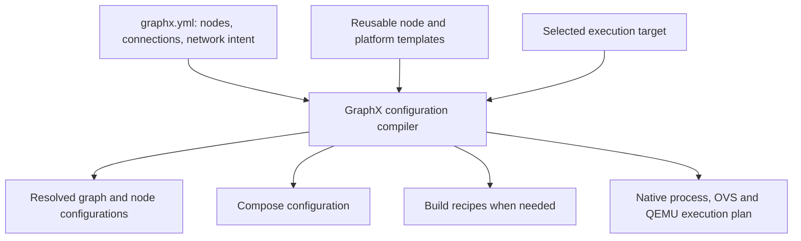

# Graph-driven deployment architecture analysis

Status: architectural proposal, not an implemented configuration contract. All
proposed syntax, commands, images, and generated artifacts below are illustrative.
The current loader accepts configuration version 2 only. This document records
the requested design analysis; it does not change current project decisions.

Make the graph description the authored deployment specification, and make
Compose a generated artifact. Templates should describe reusable node types and
platform services; individual graphs should describe node instances, connections,
and any required network behavior.

One graph description does not imply one execution mechanism. Compose can run
containers, while native processes, OVS, and QEMU require additional execution
artifacts. All should derive from the same validated graph.

The analysis covers the current example matrix, Compose configurations,
Dockerfiles, and relevant application assumptions. Backward compatibility is not
required. The objective is to minimize duplication when adding nodes and
topologies, without introducing a general-purpose orchestration framework.

## 1. Keep the architecture small



The compiler should:

1. Resolve node types and their parameters.
2. Validate ports, protocols, placement, network requirements, and capabilities.
3. Add the standard console, telemetry, and history platform.
4. Generate explicit, inspectable artifacts.

Compilation should not start containers, create interfaces, or modify
infrastructure. Execution should use Compose and the existing identity-checked
Linux infrastructure operations. This does not require a new deployment daemon
or a general-purpose orchestration framework.

Keep the C++ configuration loader authoritative. Templates provide defaults and
rendering information; they must not become a second configuration interpretation
engine.

## 2. Separate node types from node instances

A reusable node type needs a small contract:

| Property | Purpose |
|---|---|
| Image or build recipe | Supplies the executable |
| Command binding | Passes node identity and resolved configuration |
| Input/output ports | Defines names, direction, schema, protocol, and connection limits |
| Parameters | Defines supported application settings and defaults |
| Execution support | Container, native process, QEMU, or external |
| Requirements | Shared memory, interfaces, devices, architecture, privileges |
| Observation support | GraphX telemetry, packet observation, or external status only |
| Readiness behavior | Defines when peers can begin communicating |

For example, a `sample.source` type could define an output named `samples`, an
`interval_ms` parameter, and support TCP or shared memory.

The instance name could be `sensor-a`, `generator`, or `source-west`. Neither the
template nor its executable should assume a particular instance name.

That requires a real application change: the current generator, transform, and
sink executables contain fixed node and edge names. A renderer alone cannot make
those executables topology-independent.

## 3. Add the platform automatically

Every compiled graph should receive:

- The web console.
- Telemetry ingestion and graph configuration.
- Persistent SQLite history with bounded retention.
- Standard health checks, logging limits, and service security defaults.

These capabilities can initially remain in one platform container, matching the
existing telemetry image's combined responsibilities. Three capabilities do not
require three containers.

The platform should appear separately from application nodes in the console.
Graph authors should not need to declare a telemetry node or connect telemetry
edges.

Packet capture, packet decoding, Prometheus, Grafana, and remote OTLP export remain
optional features. History being enabled does not mean packet capture must run.

For external devices, the console must distinguish “declared,” “observed,” and
“emitting application telemetry.” It must not manufacture application health from
the existence of a configured device.

## 4. Concrete sample-pipeline input and output

Here is a proposed graph using deliberately different node names:

```yaml
# Proposed syntax—not accepted by the current loader.
version: 3
graph:
  id: measurement-demo

nodes:
  source:
    type: sample.source
    parameters:
      interval_ms: 500
  processor:
    type: sample.transform
  recorder:
    type: sample.sink

connections:
  samples:
    from: source.samples
    to: processor.samples
    transport: tcp
  results:
    from: processor.transformed
    to: recorder.transformed
    transport: tcp
```

No Compose file, image selection, telemetry environment variables, history
volume, or service dependency list is needed in this graph. The version number
is a proposed breaking schema change, subject to agreement.

A proposed compilation command:

```sh
graphx compile examples/sample-pipeline/graphx.yml \
  --target containers \
  --output build/deploy/measurement-demo
```

Expected artifacts:

```text
build/deploy/measurement-demo/
  compose.yaml
  resolved.json
  nodes/
    source.json
    processor.json
    recorder.json
```

The generated Compose would contain four long-running services: the three nodes
and the platform. This abbreviated excerpt illustrates the boundary:

```yaml
name: measurement-demo

services:
  platform:
    image: graphx-platform:<release>
    ports: ["127.0.0.1:8080:8080"]
    volumes:
      - ./resolved.json:/run/graphx/resolved.json:ro
      - history:/var/lib/graphx/history
    networks: [management]
  source:
    image: graphx-runtime:<release>
    command:
      - graphx-generator
      - --node
      - source
      - --config
      - /run/graphx/node.json
    volumes:
      - ./nodes/source.json:/run/graphx/node.json:ro
    networks: [management]
  # processor and recorder generated from their respective types.

networks:
  management: {}

volumes:
  history: {}
```

The image names and command arguments above are proposed contracts. Complete
output would also include credentials, health checks, bounded logging, and
security settings.

For portable TCP operation, the compiler resolves application endpoints onto
container connectivity. When a connection requests a managed OVS network, its
application endpoint must use that attachment instead.

## 5. Demonstrate every existing example

There are 14 graph configurations plus the application-capture scenario. Each
can fit the model, but preserving their current behavior requires more than
container generation. Every row below receives the standard platform service.

| Existing example | Concrete graph content | Generated application/infrastructure artifacts |
|---|---|---|
| Sample pipeline | Source → transform → sink; two TCP connections | Three container services and per-node configuration |
| Shared memory | Same node types; segments `gx-shm-samples` and `gx-shm-transformed`; capacity 8; maximum message 4096 bytes | Three native process commands for current behavior; a container placement requires an explicit shared-IPC arrangement |
| UDP unicast | Publisher → subscriber; destination `127.0.0.1:47101`; framing `u32be` | Two native process commands; explicit telemetry route to the platform |
| UDP multicast | Publisher → subscriber; group `239.255.42.1:47103`; loopback interface; TTL 0 | Two native process commands preserving the existing loopback multicast test |
| UDP broadcast | Publisher → subscriber; subnet `172.31.91.0/24`; broadcast destination `172.31.91.255:47102` | Two container services and the declared isolated connectivity segment |
| Application capture | Sample node types and connections; application capture enabled | Native process commands, capture locations, and console capture access |
| MACVLAN | Sample types on semantic MACVLAN segment `10.30.0.0/24`; addresses `.10`, `.20`, `.30` | Three containers; owned OVS bridge and veth attachments |
| IPVLAN L2 | Sample types across `10.41.1.0/24`, `10.41.2.0/24`, `10.41.3.0/24`; shared MAC behavior; router policies | Containers, OVS segments, namespace router, routes, and mirrors |
| IPVLAN L3 | Three subnet domains under `10.42.0.0/16`; shared MAC; routed unicast semantics | Containers, veth attachments, and OVS L3 forwarding rules |
| Mixed network | Source on `10.10.0.0/24`; processor and sink on `10.20.0.0/24`; router between semantic profiles | Containers, two OVS domains, namespace router, routes, and mirrors |
| Network observation | Externally managed QEMU source; TAP; mirror; bounded capture; delay/jitter/loss definition | OVS/TAP/capture artifacts; no QEMU boot action |
| Static routes and policy | Left/middle/right diagnostic endpoints; permitted and denied flows; deferred route to `10.64.30.10/32` | Namespace process commands, OVS infrastructure, policies, and a separately invocable route action |
| Simulated SDR | Radio simulator → processor → result sink; UDP samples, mTLS control, TCP results | Three containers, generated endpoints and credential references; capture/observer services when selected |
| External SDR | External radio at `10.63.0.10`; managed processor and sink at `.20` and `.30`; raw sample/control/result connections | Two application containers, OVS attachments, external-device bindings, optional observation services |
| QEMU TAP | Guest at `10.0.2.15`; namespace peer at `10.0.2.2`; bidirectional TCP/UDP; VLAN 42 and isolated VLAN 43 | Guest build references, QEMU invocation, namespace peer commands, TAP/OVS/VLAN/mirror configuration |

These mappings preserve important distinctions:

- MACVLAN/IPVLAN remain OVS semantic profiles.
- The network-observation example continues to leave guest startup external.
- Static-route tests retain routes that are deliberately absent at startup.
- Native shared-memory and loopback multicast tests remain native tests.
- The external SDR simulator used by a laboratory is an explicit test fixture,
  not part of a physical radio's production deployment.

## 6. Concrete SDR topology without copied Compose

A proposed simulated SDR graph:

```yaml
version: 3
graph:
  id: sdr-lab

nodes:
  radio:
    type: sdr.simulator
  processor:
    type: sdr.processor
  recorder:
    type: sdr.result-sink

connections:
  iq:
    from: radio.samples
    to: processor.samples
    transport: udp
    encoding: raw
  control:
    from: processor.control
    to: radio.control
    transport: tcp
    encoding: raw
    security:
      profile: demo-mtls
  results:
    from: processor.results
    to: recorder.results
    transport: tcp
    encoding: raw
```

Port contracts supply the established SDR ports, schemas, and listener roles.
The compiler supplies peer addresses and per-node credential mounts.

For two radios, authors add `radio-east`, `radio-west`, their processors, and
their connections. They do not copy telemetry, history, TLS setup, or Compose
service definitions.

A shared recorder is valid only if its type explicitly supports multiple
producers. Otherwise, compilation rejects the topology or requires separate
recorder instances.

To use a physical radio, replace its execution selection:

```yaml
radio:
  type: sdr.radio
  execution:
    kind: external
    address: 10.63.0.10
  credentials:
    control: lab-radio-credentials
```

To use a QEMU radio implementation:

```yaml
radio:
  type: sdr.radio
  execution:
    kind: qemu
    guest: sdr-radio-image
    architecture: x86_64
    accelerator: tcg
```

Both are proposed examples. The QEMU guest must actually implement the declared
radio protocol and credential provisioning contract. Selecting QEMU cannot
supply missing application functionality.

## 7. Keep network intent explicit where it matters

Ordinary TCP graphs should not need bridge names, veth names, or IP assignments.
Network laboratories do need explicit semantics. For example:

```yaml
networks:
  radio-lan:
    realization: ovs
    profile: macvlan
    subnet: 10.63.0.0/24

attachments:
  radio.data:
    network: radio-lan
    address: 10.63.0.10
  processor.data:
    network: radio-lan
    address: 10.63.0.20
```

The compiler derives physical resource names and container attachment bindings.
Advanced configurations can declare routers, VLANs, mirrors, policies, and
routes without duplicating those declarations in shell scripts.

Connections must select an attachment when multiple paths are possible. The
compiler should reject ambiguity rather than silently select the management
interface.

Platform routing also needs care: management connectivity must not provide an
unintended alternative path around the network being tested.

## 8. Reuse images; generate Dockerfiles only for new software

A topology change should normally generate zero Dockerfiles.

Use shared images for:

- Native GraphX applications.
- SDR services.
- The console/telemetry/history platform.
- Optional observation tools.

Remove the sample configuration and generator default entrypoint from the common
runtime image. Supply graph configuration at deployment time.

For a genuinely new application, a node type may select a build template with
explicit source, dependencies, build steps, and entrypoint. Cache and reuse that
image across all instances of the type.

QEMU kernel, initrd, and disk artifacts need a separate guest build recipe. A
Dockerfile may build those artifacts, but they are not container images that
Compose can run.

## 9. Replace sample-specific feature overlays with platform settings

| Current overlay | Proposed graph/platform selection |
|---|---|
| History | Default platform behavior; graph may set retention limits |
| Observability | Optional Prometheus/Grafana extension |
| Control | Policy and credential references targeting declared node IDs |
| Control rotation | Credential rollover configuration and verification fixture |
| Secure OTLP | Export endpoint, CA, and token references |
| OTLP mTLS | Client certificate and key references |

Credential values should remain outside graph files. Generated policy references
should derive from declared nodes, with no implicit permissions granted merely
because a node exists.

## 10. Issues requiring resolution

The following table records the original analysis. For the architectural review
requested in `architectural-review-prompt.md`, all recommended resolutions below
are accepted premises, rather than open questions.

| Issue | Recommended resolution |
|---|---|
| I-01 — Breaking configuration contract | Agree on a new schema version and canonical filename; replace the current format deliberately rather than maintain two interpretations. |
| I-02 — Node execution contract | Require explicit node identity and port bindings. Remove fixed `generator`, `samples`, and `transformed` assumptions before claiming arbitrary topology support. |
| I-03 — Graph expressiveness | Define fan-in, fan-out, feedback cycles, and supported schemas per node type. Communication edges must not automatically become startup dependencies. |
| I-04 — Placement and locality | Preserve native execution for native examples. Require shared-memory peers to share an explicitly supported IPC domain. Never reinterpret loopback as a remote endpoint. |
| I-05 — Portable connectivity versus managed data plane | Specify which connections may use portable container connectivity and which require OVS. Resolve broadcast/multicast interfaces explicitly. |
| I-06 — Address allocation and isolation | Derive names and ordinary endpoints; require explicit laboratory addresses when behavior depends on them. Detect host-port and interface-name conflicts. |
| I-07 — QEMU ownership and guest contract | Distinguish managed guest startup from external guest attachment. Specify guest artifacts, configuration delivery, readiness, credentials, and accelerator requirements. |
| I-08 — External devices and observations | Separate execution ownership from raw versus GraphX encoding. Declare available observation mechanisms; do not assume every device emits telemetry. |
| I-09 — Startup and test actions | Separate baseline deployment from timed faults, deferred routes, credential rotation, and verification traffic. Preserve existing test intent. |
| I-10 — Platform access and storage | Define native-process telemetry access, Lima console forwarding, default history limits, and explicit history deletion. Keep privileged state and high-I/O artifacts in Linux. |
| I-11 — Template extensions | Define a small validated template contract. Avoid arbitrary Compose overrides that bypass graph validation and recreate duplicated configuration. |

## 11. Design acceptance before implementation

Approve an illustrative input and expected generated output for each of the 15
scenarios above, including the six platform feature variants. Include negative
examples for ambiguous endpoints, unsupported fan-in, incompatible placement,
and missing guest artifacts.

The strongest independence check is to rename every sample node and edge, add a
second independent source/processor pair, and generate the deployment without
changing any shared template. If that requires a sample-specific branch in the
compiler, the design has not met the simplification objective.

This analysis does not establish executable support or verification results for
the proposed configurations.
