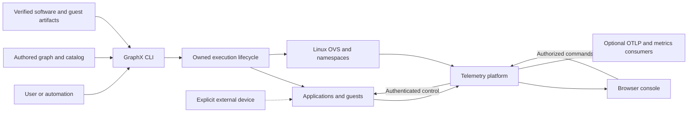
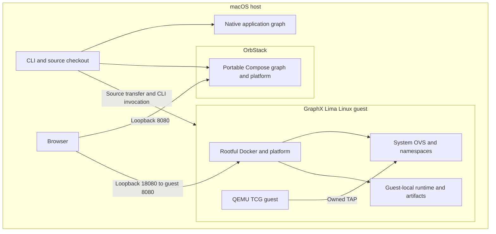
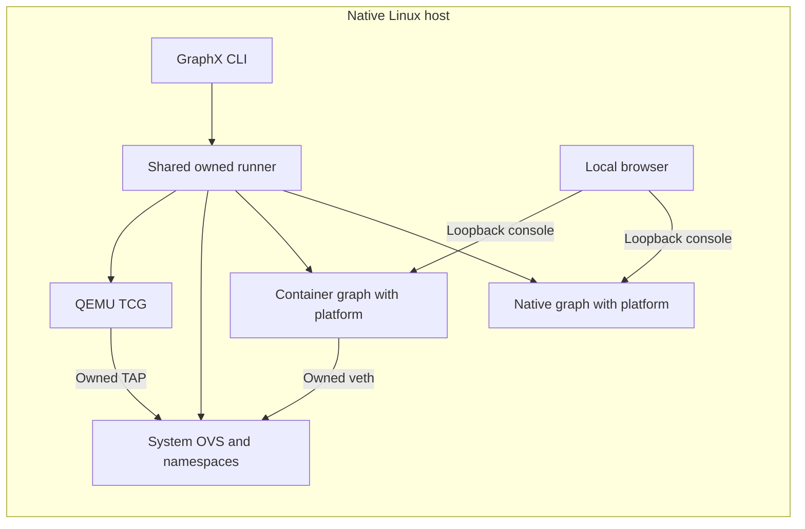
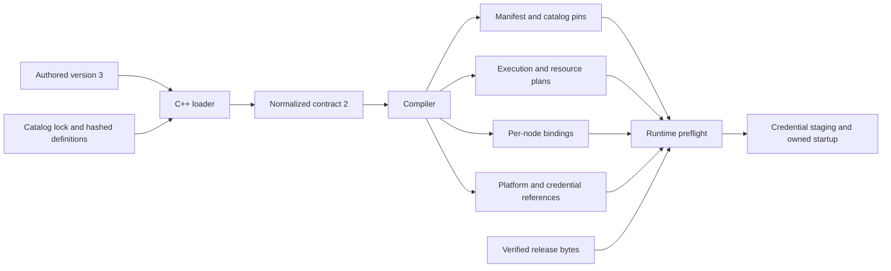
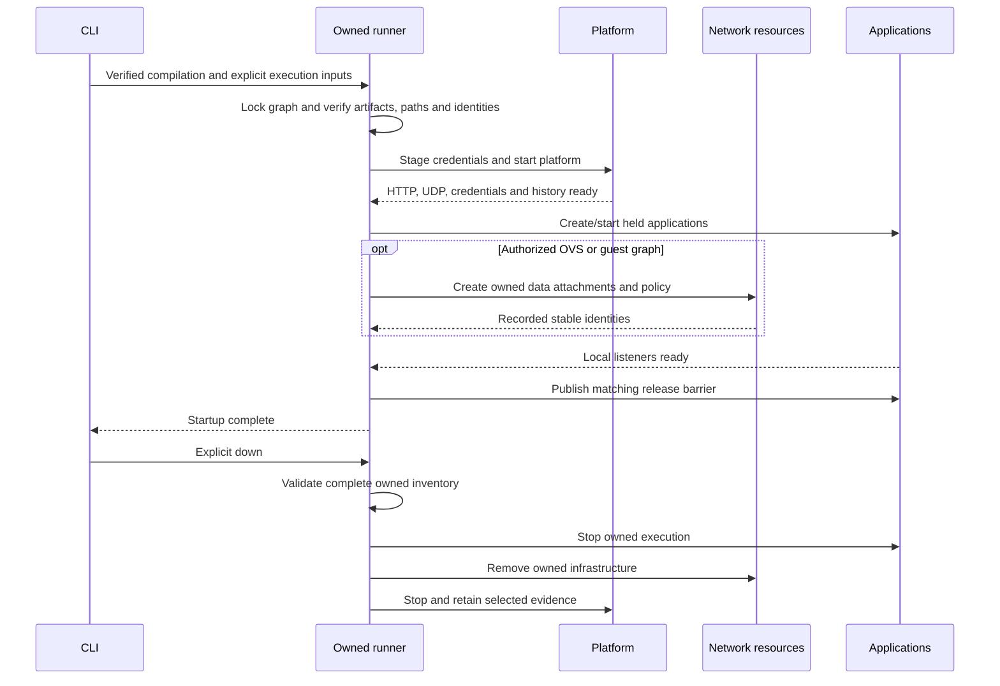
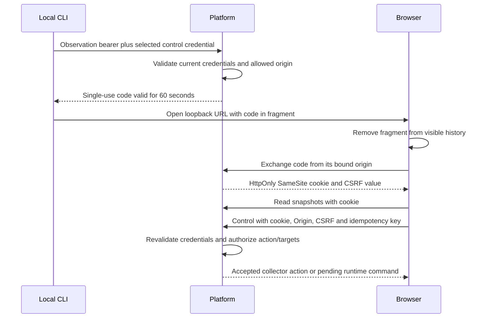

# GraphX 1.1.0 architecture

This document describes the implemented system for engineering review. GraphX
turns one authored graph into validated runtime contracts, inspectable artifacts,
an owned deployment and observed application/network behavior. The intended setting
is a controlled laboratory with trusted host administrators, explicit privileged
operations and bounded workloads. It is not a distributed scheduler, high-availability
controller, general physical-network manager or automatic schema migration service.

The [user guide](user-guide.md) explains operation. The
[review checklist](#architecture-review-checklist) identifies decisions and residual risks;
[verification report](documentation-verification.md) distinguishes checks run for
this documentation from prior runtime evidence. Accepted constraints are recorded
in [project decisions](project-decisions.md).

## Contents

**System architecture**

- [System context and responsibilities](#system-context-and-responsibilities)
- [Deployment boundaries](#deployment-boundaries)
- [Configuration and artifact contracts](#configuration-and-artifact-contracts)
- [Identity and persistent state](#identity-and-persistent-state)
- [Startup, readiness, failure and stop](#startup-readiness-failure-and-stop)
- [Application data and transport contracts](#application-data-and-transport-contracts)
- [Management and data-plane networking](#management-and-data-plane-networking)
- [Managed guests and explicit scenarios](#managed-guests-and-explicit-scenarios)
- [Telemetry, history and capture](#telemetry-history-and-capture)
- [Credentials, browser sessions and control](#credentials-browser-sessions-and-control)
- [Bounds and failure handling](#bounds-and-failure-handling)
- [Artifact supply and release qualification](#artifact-supply-and-release-qualification)
- [Verification and review scope](#verification-and-review-scope)

**Contracts and review reference**

- [Transport lifecycle](#transport-lifecycle)
- [Envelope protocol](#envelope-protocol)
- [In-process transport](#in-process-transport)
- [Shared-memory transport](#shared-memory-transport)
- [UDP transport](#udp-transport)
- [TCP transport](#tcp-transport)
- [Unix-domain socket transport](#unix-domain-socket-transport)
- [Network ownership reference](#network-ownership-reference)
- [Control policy reference](#control-policy-reference)
- [Security model](#security-model)
- [Architecture review checklist](#architecture-review-checklist)

## System context and responsibilities



The CLI owns preparation and finite lifecycle operations. The platform owns
observation and bounded control delivery. Applications carry data across configured
connections. External devices remain outside GraphX ownership; declaring an address
does not authorize attaching a physical NIC. The physical SDR startup path remains
gated; the laboratory simulator is a separate explicit selection.

| Component | Responsibility and implementation evidence |
|---|---|
| Public C++ API | [include/graphx](../include/graphx/) defines configuration, transport, node settings, ownership and execution contracts. |
| CLI entry point | [apps/cli/main.cpp](../apps/cli/main.cpp) dispatches validation, compilation and execution. [src/example_cli.cpp](../src/example_cli.cpp) delegates the workspace workflow to its installed Python helper. |
| Workspace orchestration | [scripts/example_cli.py](../scripts/example_cli.py) discovers examples, invokes the authoritative loader, selects artifacts, maintains private launch references, dispatches to Lima and opens authenticated consoles. It does not independently parse YAML. |
| Configuration resolution | [src/config_v3.cpp](../src/config_v3.cpp) loads pinned catalog definitions, resolves node instances and endpoints, validates target/network/control references and emits normalized values. |
| Compilation | [src/compile.cpp](../src/compile.cpp) projects resolved contracts into execution artifacts; [src/compile_output.cpp](../src/compile_output.cpp) handles output publication. |
| Execution and ownership | [src/execution.cpp](../src/execution.cpp) verifies compilation/release identities and runs native lifecycles. [src/infra/compose_execution.cpp](../src/infra/compose_execution.cpp) coordinates containers and privileged resources. |
| Reusable infrastructure | [src/infra](../src/infra/) contains resource-specific modules behind the common lifecycle, lock and ownership store. |
| Application behavior | [src/sample_application.cpp](../src/sample_application.cpp), [src/diagnostic_application.cpp](../src/diagnostic_application.cpp) and [src/node_settings.cpp](../src/node_settings.cpp) implement reusable behavior; executable entry points stay under [apps](../apps/). SDR services live under [examples/sdr-node/common](../examples/sdr-node/common/). |
| Platform and console | [apps/telemetry](../apps/telemetry/) contains staging, ingestion, control, history and HTTP/WebSocket services. [web/src](../web/src/) presents normalized topology and actual runtime evidence. |
| Artifact supply | [scripts/release](../scripts/release/), [Dockerfile](../Dockerfile) and [guests](../guests/) produce independently verifiable native, platform, image and guest artifacts. |

## Deployment boundaries





Native and container graphs in this diagram are alternative application placements,
not permission to mix native/container applications in one graph. A guest/container
laboratory uses its permitted combined execution model.

Native Linux uses the same Linux process, Docker and OVS modules directly rather
than a platform-specific data-plane implementation. Its host CLI and browser can
use loopback 8080. Native macOS supports native-process graphs; OrbStack supports
portable container placement. OVS, namespace and managed guest execution require
native Linux or Lima with explicit authorization. Native and container applications
cannot be mixed in one authored graph.

The [target catalog](../config/catalog/targets.json) and loader enforce capability
selection. Validation defaults to `native-linux` independently of the host;
workspace commands infer a target from the host and execution model. Accepted
validation is separate from actual deployment qualification.

On macOS, [Lima orchestration](../infrastructure/lima/common.sh) checks VM name,
repository identity, architecture, virtualization type and the configuration digest.
The digest covers `graphx.yaml` and `provision.sh`; changing a host helper alone
does not invalidate provisioned configuration. Runtime commands do not create or
replace the VM. Privileged sockets never cross to macOS. Source snapshots,
builds and runtime evidence stay under `/var/lib/graphx/examples` for the workspace
workflow. See [Lima environment](../infrastructure/lima/README.md).

## Configuration and artifact contracts



The authoritative authored schema is
[graphx.schema.json](../config/schema/graphx.schema.json); normalized consumers use
[normalized-graph.schema.json](../config/schema/normalized-graph.schema.json).
Catalog definitions and their SHA-256 lock constrain types, ports, templates,
wire schemas and supported targets. Unknown fields, unsupported authored versions,
invalid references and incompatible transport/placement combinations are rejected.
The loader derives shared connection settings once; endpoints receive corresponding
listen/connect bindings instead of reconstructing peer settings independently.

Normalized JSON contains credential references rather than credential material.
The platform's [normalized reader](../apps/telemetry/normalized-config.mjs) validates
that contract, and [platform-config.mjs](../apps/telemetry/platform-config.mjs)
requires its sibling projections and credential manifest to agree. It does not
normalize authored YAML at service startup. The C++ [node reader](../src/node_settings.cpp)
checks the selected node, type revision and resolved execution/binding contract.

Compilation is deterministic and does not probe Docker, provision credentials,
start applications or create infrastructure. Applicable artifacts include
`compile-manifest.json`, `resolved.json`, `catalog-pins.json`, `nodes/`,
`platform.json`, `credentials.json`, execution/native/OVS/QEMU/scenario plans and
capture handoff configuration. `compose.yaml` contains canonical JSON, which is
valid YAML 1.2. No source graph selects a custom Docker build context.
Output publication uses private staging and exclusive atomic publication;
existing output is not overwritten. [Compiler tests](../tests/test_compile.py)
exercise repeated, shuffled and relocated inputs and output-integrity boundaries.

A supported execution-plan flag does not establish artifact trust. The source
catalog contains illustrative pins; release packaging supplies pins derived from
actual verified bytes. Startup checks the compiled manifest and the supplied
installation/image/guest identities. Editing a generated projection invalidates
its manifest. Configuration compatibility, type revision, artifact identity and
runtime resource ownership are separate checks.

## Identity and persistent state

| Identity or artifact | Meaning |
|---|---|
| Authored graph ID | User-selected logical name. The example workflow generates an invocation graph ID with a suffix when preparing a new generation. |
| Configuration hash | Binds owned runtime state to its compiled configuration. |
| Owner token | Runtime ownership identity; resource names alone never authorize adoption or deletion. It is not the browser control bearer. |
| Stable resource identity | Process start identity and executable hash, Docker object ID/labels, OVS UUID, interface identity, or directory inode as appropriate. |
| Launch reference | Private `current.json` and macOS `remote.json` locate a generation, artifacts and source snapshot. They do not contain observation/control tokens or replace the ownership ledger. |
| Ownership ledger and lock | Common graph state describing creation intents, observed identities and recoverable resource/action state. |
| Credential generation | Published member hashes and rotation metadata used to reject incomplete or stale staged trust. |

[Ownership state](../src/infra/ownership_state.hpp),
[ownership locking](../src/infra/ownership_lock.cpp) and
[lifecycle coordination](../src/infra/lifecycle_coordinator.cpp) define the shared
boundary. Runtime roots must be canonical and must not overlap immutable compiled
or release inputs. Secrets are staged separately with restricted modes and
consumer-specific exposure.

## Startup, readiness, failure and stop



The diagram shows logical ordering; adapter-specific holding and guest handshake
mechanisms enforce the same prerequisite boundaries. Containers are held before
application exec while data interfaces and management ACLs are prepared. Listeners
must then report readiness before connectors are released. Guest graphs allow a
longer release wait to accommodate provisioning.

Authored `lifecycle: {startup: available, readiness_ms: 5000}` selects bounded
subset startup for native or container application graphs. The default remains
transactional. Temporary application exits (75), signal termination and readiness
timeouts permit degraded release; unknown startup errors, invalid configuration,
authentication, release and infrastructure identity failures reject startup.
Timed-out applications are stopped before release and are not restarted. `status`
reports application admission and current process availability, not throughput.
A missing VITA processor or all radios unavailable reports acquisition unavailable.
Use per-stream result freshness in processor/detector logs to distinguish live
processes from fresh output. Restore failed applications with explicit whole-graph
restart; this interrupts healthy nodes. See the
[P4 lifecycle contract](../design/four-radio-vita/lifecycle-design.md).

Startup is finite and the CLI returns; there is no continuous reconciliation or
automatic restart service. Interruptions before release trigger bounded rollback.
Creation intents are recorded before mutation so a later invocation can inspect
partial progress. Cleanup checks the full inventory before destructive actions;
replacements, collisions and inconsistent ledgers fail closed. It does not silently
adopt a same-named object or recreate a missing baseline.

Native processes are checked using PID/start identity and executable evidence;
containers use immutable Docker identity and labels. Shutdown retains history,
selected captures and bounded logs while removing owned execution resources and
credential volumes. Shared artifact caches remain. SQLite deletion is an explicit,
inactive-writer, owner-checked operation, not part of `down`.
[Native tests](../tests/test_execution.py) and
[ownership tests](../tests/test_ownership_state.cpp) establish lifecycle and refusal
behavior; [live OVS tests](../tests/test_ovs_execution_live.py) require separate
privileged acceptance. See [execution](user-guide.md#execution-administration) for operational recovery.

## Application data and transport contracts

Applications consume resolved settings and the release barrier through common
node bindings. Sample source/transform/sink behavior supports finite counts or
`max_messages: 0` for explicit continuous operation. Renaming an instance does not
change its catalog role. An unexpected upstream disconnect is an error rather than
successful completion in continuous mode.

[Transport APIs](../include/graphx/transport.hpp) distinguish message, timeout,
end-of-stream and cancellation outcomes. Implementations cover TCP, UDP,
Unix-domain sockets, shared memory and in-process queues. Each resolved edge owns
one transport-specific settings variant: retry/TLS settings cannot accidentally
be applied as UDP multicast or queue-capacity settings. Raw external connections
are observation contracts and are excluded from the managed GraphX transport factory.

[Envelope serialization](../src/envelope.cpp) uses wire version 2, bounded payloads,
sequence/time, message/trace/parent identities, type and attributes. TCP and Unix
streams use four-byte big-endian framing; UDP carries a complete framed envelope
per datagram. Queue transports validate envelopes before publication. The
[protocol reference](#envelope-protocol) describes the 16 MiB envelope ceiling and malformed
input rejection. Transport-specific datagram and queue limits can be smaller.

## Management and data-plane networking

System Open vSwitch is the only managed network backend. MACVLAN and IPVLAN are
semantic profiles implemented using OVS and Linux policy, not Docker network
drivers. A managed container data endpoint is an identity-owned veth pair; a QEMU
endpoint is an owned TAP. Router interfaces use namespace attachments, with
address aliases, ordered policies and declared routes. Manual routes remain
inactive until their explicit action runs.

Compose owns processes and management bridges. In privileged network graphs,
[management policy](../src/infra/management_policy.cpp) restricts permitted platform
connectivity so management does not become an unintended data-plane route.
The console bridge exposes loopback HTTP and supports configured platform egress;
application management bridges remain internal. UDP telemetry is not published to
the host. Network `edge_paths` connects logical graph edges to declared infrastructure
hops; a portable graph does not acquire an OVS path merely because Docker is running.

[Endpoint resources](../src/infra/endpoint_resources.cpp),
[OVS resources](../src/infra/ovs_resources.cpp) and
[namespace resources](../src/infra/namespace_resources.cpp) enforce backend identity.
[Network infrastructure](#network-ownership-reference) explains the user-visible model.
No physical uplink is attached implicitly.

## Managed guests and explicit scenarios

[QEMU resources](../src/infra/qemu_resources.cpp) use verified x86_64 guest artifacts,
TCG, the dedicated UID/GID 65532 account, one owned TAP and local QMP. Runtime
directory and process identities join the ordinary ledger. Three bounded local
virtio channels provision resolved configuration, credential generations and readiness.
The guest invokes the authoritative node reader and starts its fixed application
without a fabricated management NIC. The [guest artifact guide](../guests/README.md)
describes its 120-second handshake and 180-second peer release wait.

[Scenario execution](../src/infra/scenario_execution.cpp) selects declared actions
under the common graph lock. It supports bounded traffic checks, owned netem faults,
manual route apply/clear, credential rotation and guest checks. Actions do not run
at baseline startup. Pending action records refuse blind replay after interruption;
recovery uses the common owned down/up lifecycle. The external simulator instead
requires explicit pre-start laboratory selection and separate test trust.

Guest traffic acceptance covers its resolved unicast TCP/UDP contract, VLAN
isolation, capture and QMP. It does not establish multicast/broadcast guest support,
KVM support, or physical radio connectivity. See [scenario contracts](user-guide.md#scenario-actions)
and the [review evidence boundary](#architecture-review-checklist).

## Telemetry, history and capture

[Collector](../apps/telemetry/collector.mjs) verifies bounded telemetry envelopes
and combines runtime evidence with normalized topology. Each managed observed node
has a staged HMAC identity. External nodes do not receive invented managed
identities. Replay, timestamp and node binding checks precede accepted observations.
The [metric store](../apps/telemetry/metric-store.mjs) maintains measured counters,
latency buckets and derived five-second rates. Reset clears its live collected
metrics, not application state or retained SQLite history.

[HTTP routes](../apps/telemetry/http-routes.mjs) separate bounded public health
from authenticated topology, graph readiness, history, captures and metrics.
[Server](../apps/telemetry/server.mjs) delivers snapshots over authenticated WebSockets.
[Web consumers](../web/src/useTelemetry.js) reconnect and display actual topology;
missing evidence is not replaced by sample nodes. The console is an operational
view, not an alternative configuration authority.

[History](../apps/telemetry/history.mjs) and its
[worker](../apps/telemetry/history-worker.mjs) use SQLite WAL with bounded queues,
queries, retention and aggregate database storage. Ownership and schema mismatch
reject opening instead of silently migrating data. Query/storage failure degrades
history separately from live traffic. OTLP export is bounded and asynchronous;
export failure does not synchronously block application transport.

Application capture uses USER0 for GraphX envelopes and USER1 for raw SDR bytes.
OVS mirrors capture Ethernet with an identity-owned Linux observer. The platform
receives sealed snapshots rather than access to privileged live capture sockets.
[Capture handoff](../src/infra/capture_handoff.cpp) and
[capture-file validation](../apps/telemetry/capture-files.mjs) constrain paths,
file types, sizes and traversal. The [capture guide](user-guide.md#capture-reference) explains which
evidence is available to users.

## Credentials, browser sessions and control

[Credential staging](../apps/telemetry/credentials.mjs) supports runtime-generated,
lab-generated and externally provisioned references. External trust is copied,
not silently replaced. Reference directories and files have restricted modes;
consumer mounts expose only required references. Rotation preserves provider,
identity and roles, publishes generation hashes and bounds previous-credential
overlap. Existing TLS sessions retain negotiated identity until reconnect.



The [session implementation](../apps/telemetry/console-session.mjs) holds secrets
in bounded server memory, not public bootstrap assets. Codes are single-use and
origin-bound. Sessions last up to eight hours, use a graph-specific cookie name,
and revalidate underlying credentials. HTTPS adds Secure to HttpOnly/SameSite=Strict.
Cookie-authenticated controls require CSRF; mutations also require the session
origin. WebSockets require the session origin and are rechecked before publishing
new snapshots. Platform replacement invalidates sessions. Session timing uses
wall-clock expiry; credential overlap also has its own rotation timing contract.

The [CLI handoff](../scripts/example_cli.py) only opens loopback URLs and does not
follow redirects while carrying bearer credentials. It opens the host browser for
Lima, never a guest browser. `--json` and `--no-open` suppress automatic opening;
manual token retrieval remains explicit. No control permission is added by login.
When multiple credentials exist, the caller must select an operator for control;
otherwise the session is observation-only. [Frontend auth](../web/src/auth.js)
removes the fragment, restores the session after refresh and supplies CSRF without
exposing the underlying tokens.

[Control authorization](../apps/telemetry/control.mjs) and platform grants preserve
action/target scope. Pause/resume reach authorized live runtime or QMP endpoints
and require acknowledgements; request acceptance alone is not application completion.
Reset targets `collector` and is synchronous at the collector. Idempotency keys
bind retries to intent; conflicting reuse is rejected. Durable audit records remain
separate from ordinary observation history queries. Fault injection uses the
privileged scenario lifecycle, not a browser fault shortcut.

### Node-console boundary

The owned `mg-node-console` relay projects node output into an identity-checked
console directory. It reads atomically published ownership state without holding
the mutation lock, checks each process or container identity, and writes bounded
read-only snapshots. QMP ring consumption is coordinated with scenario actions
through the graph lock; each consumer mirrors output into the same bounded boot
window, preserving diagnostics for the relay. Containers are queried by exact ID, graph/owner labels and
image identity. The existing stop lifecycle stops the relay; restart verifies and
replaces its retained directory. The ledger records directory device/inode and a
fresh console generation, plus recorded device/inode identities for each serial socket. A stable release executable, or a private verified copy
for container-only launches, keeps development rebuilds from replacing a live relay.

The platform mounts only the console directory read-only. It receives no Docker,
QMP, guest-provisioning socket or ownership-ledger access. File handoff supports
OrbStack without forwarding a privileged socket to macOS. QEMU boot output remains
on its bounded ttyS0 ring, read internally through QMP with byte-safe encoding.
QEMU also receives a directory descriptor before dropping host privileges, allowing
its dedicated ttyS1 socket to be created without opening traversal through the
private graph state directory. That descriptor is the only additional inherited
capability; it is not a browser interface.

`GET /api/nodes/ID/logs` and `GET /api/nodes/ID/serial` require observation access.
`POST /api/control/serial/ID` supports acquire, renew, input and release under an
explicit QEMU-node `serial` grant. The existing console-session attachment applies
CSRF and origin checks. Credentials are checked on each request and writer leases
are also swept for expiry/revocation. The platform maintains at most 64 serial
connections, one writer per guest, and a 64 KiB output ring per serial connection.
Polling responses are bounded; serial byte offsets expose replay gaps. A guest
restart invalidates its writer and output cursor. Browser-session expiry bounds
writer lifetime even when its underlying operator token remains valid.

The serial renderer is pinned `@xterm/xterm` 5.5.0 (MIT), using its byte-stream API.
Guest clipboard, title and link activation are disabled. Keyboard input is bounded,
never placed in URLs and never included in audit events. Audit records cover serial
connections, writer changes and denials. Guest login is an image responsibility:
this access transport does not provision an account or authorize a host shell.

Sources: [relay](../src/infra/node_console.cpp),
[platform API](../apps/telemetry/node-console.mjs),
[panel](../web/src/components/NodeConsolePanel.jsx), and
[implementation verification](../design/node-console/verification.md).

## Bounds and failure handling

| Boundary | Implemented constraint or failure response |
|---|---|
| Authored/normalized configuration | Closed schemas, bounded file reads and catalog/reference checks; malformed or unsupported contracts fail before execution. |
| Runtime artifacts | Exact inventory/hash verification; changes fail before startup or mutation. |
| Processes and commands | Bounded startup/command waits and output; native logs retain a 2 MiB current stream plus one previous log. Application allocation limits are not a kernel RSS limit. |
| Container runtime | Non-root applications, dropped capabilities, read-only root, resource/log limits and no automatic restart policy. Privileged host orchestration is a separate trust boundary. |
| Browser login | At most 128 pending handoffs and 128 sessions per platform instance, 16 KiB request body and a ten-second body-read deadline. Capacity exhaustion refuses new login state. |
| Capture/history/export | Provider-specific file, storage, queue, response and time bounds; failures are reported without claiming missing evidence exists. |
| Ownership mismatch | Fail closed and retain evidence; no name-based adoption, broad prune or automatic ledger rewrite. |
| Interrupted scenarios | Pending records prevent unsafe retry; explicit owned recovery is required. |

Bounds are enforced at different layers and are not a single global resource quota.
Schemas, type parameters and platform configuration define additional limits.
Trusted local administrators remain able to access process memory, staged files
and Docker state. Loopback/session authentication is not a multi-tenant host
security boundary. Review [security](#security-model) and the
[architecture checklist](#architecture-review-checklist) before widening exposure.

## Artifact supply and release qualification

Native archives contain reusable binaries and contracts. A separately verified
platform companion contains the pinned Node runtime, production modules and web
assets. Shared runtime/telemetry/SDR images have fixed recipes; graphs are staged
at execution, not baked into images. Guest outputs have their own bounded
manifest, executable/architecture and provenance checks.

[Image release tooling](../scripts/release/image_release.py) builds twice, verifies
image contents and SPDX inventories, canonicalizes OCI archives and derives a
release catalog from those bytes. Cache-eligible repeat builds are not equivalent
to independent no-cache qualification. [Installation](../scripts/release/install_release.py)
checks compatible native/platform inputs and produces the receipt consumed by the
runner. [Guest release tooling](../scripts/release/guest_release.py) verifies guest
bytes and creates a combined installation. Offline image digests alone do not
establish registry availability or publication.

Local dirty candidates are explicitly marked and are not published releases.
Clean-tree, cross-platform and independent-repeat qualification require their
own evidence. The [release process](user-guide.md#release-administration) documents construction
and publication separately. Checksum identity establishes consistency, not a
substitute for reviewing provenance and the source supplying a trusted digest.

## Verification and review scope

The configuration/compiler suites cover supported/unsupported target matrices,
negative input and deterministic artifact boundaries. Ownership and lifecycle
suites cover interruption, collisions and identity refusal. Node tests exercise
HTTP control, sessions, history, capture and exporters; web tests exercise
request construction and presentation behavior. Privileged OVS and actual guest
execution are separate acceptance suites with explicit environment authorization.

The [documentation verification report](documentation-verification.md) records
what was rerun for this package. Prior Lima, TCG, OrbStack and Safari results are
identified as prior evidence rather than fresh release qualification. The
[review checklist](#architecture-review-checklist) records remaining evidence gaps and
questions without changing accepted design decisions.

## Transport lifecycle

GraphX transports expose typed receive outcomes: message, timeout, end of stream,
and cancellation. The convenience `receive()` method returns the message when that
is all a caller needs. Built-in transports implement bounded connection, send,
receive, backpressure, and shutdown behavior.

Infrastructure uses one create/status/recover/destroy lifecycle. The ownership
ledger records the graph ID, configuration hash, owner token, expected objects, and
stable identities for resources that were created. Create publishes state
atomically; recover and destroy verify the complete identity set before mutation.
Collisions, replacements, partial ownership, and insecure state files fail closed.

## Envelope protocol

GraphX uses one binary envelope format. Multi-byte integers are network byte order.
Stream transports prefix each envelope with a four-byte unsigned length.

The envelope contains:

1. magic `GXE` and wire version `2`;
2. sequence and nanosecond timestamp;
3. 128-bit message ID, trace ID, and optional parent message ID;
4. length-prefixed type;
5. a bounded set of sorted, length-prefixed attributes;
6. length-prefixed payload.

Message and trace IDs are non-zero lowercase hexadecimal identities. The all-zero
parent field means no parent. Duplicate attribute keys, trailing bytes, malformed
identities, unsupported versions, and envelopes over 16 MiB are rejected.

TCP and Unix-domain transports use `u32be` framing. UDP carries one complete
envelope per datagram when framing is enabled. In-process and shared-memory
transports validate the same envelope before publication. Raw external data-plane
edges use `framing: none` and do not enter the GraphX transport factory.

The Wireshark dissector in `wireshark/graphx.lua` decodes framed USER0 captures and
the configured UDP port range.

## In-process transport

The in-process transport is a bounded, mutex-protected FIFO shared by endpoints
created for one named channel. Its default capacity is 64 envelopes.

`backpressure: block` waits for capacity for at most `send_timeout_ms`.
`backpressure: reject` fails immediately when the queue is full. Neither policy
allocates overflow storage. A blocked sender and receiver are both woken when
the channel closes.

Committed envelopes drain in FIFO order after peer close. A subsequent typed
receive reports `end_of_stream`; receive after closing the local transport
reports `cancelled`; an elapsed deadline reports `timeout`.

Every endpoint sharing a named channel must specify identical `capacity`,
`backpressure`, and `send_timeout_ms` values. The transport factory rejects a
second endpoint with inconsistent settings instead of silently selecting one.

## Shared-memory transport

GraphX provides a bounded, copy-based, single-producer/single-consumer transport
using POSIX `shm_open`, `mmap`, and process-shared pthread synchronization. It is
intended for local processes on one Linux or macOS host.

<a id="shared-memory-transport-current-layout"></a>

### Current layout

One mapped segment contains:

1. a magic value and layout version;
2. configured ring capacity and maximum framed-message size;
3. monotonic head and tail sequence counters;
4. producer and consumer process IDs, closed state, and recovery count;
5. a process-shared mutex plus `not_empty` and `not_full` condition variables;
6. fixed-size slots containing a native `uint32_t` slot length and the exact
   GraphX `u32be + Envelope` framed bytes.

Slots are selected with `sequence % capacity`; payload bytes are copied into and
out of the ring. The transport does not expose mapped memory to node code or
attempt zero-copy ownership transfer.

The total payload capacity is limited to 256 MiB. A slot can hold at most
16,777,220 bytes, including the four-byte frame prefix. Connector settings must
exactly match the segment's capacity and maximum message size.

<a id="shared-memory-transport-ownership-and-lifecycle"></a>

### Ownership and lifecycle

`listen` is the sole consumer and segment owner. It refuses to replace a segment
whose recorded consumer process is still alive. An abandoned segment is unlinked
and recreated. `connect` claims the sole producer role and waits up to
`connect_timeout_ms` for the owner to create and initialize the segment.

An orderly close marks the channel closed, wakes both sides, and lets the owner
unlink the POSIX name. Mapping cleanup is deferred until object destruction so a
control thread can safely cancel a blocked receive. The consumer drains already
committed messages before reporting peer end-of-stream. A local close reports
`cancelled`; an empty live ring reports `timeout` at its receive deadline.

Segments are created with mode `0600`. GraphX does not provide authorization or
encryption above operating-system ownership; do not use a shared segment across
untrusted processes.

<a id="shared-memory-transport-backpressure"></a>

### Backpressure

The `block` policy waits on `not_full` for at most `send_timeout_ms`. The `reject`
policy immediately throws when the ring is full. There is no overflow allocation
or hidden unbounded queue. Oversized messages are rejected before taking a slot.

<a id="shared-memory-transport-crash-behavior"></a>

### Crash behavior

Both sides record process IDs. Waiters periodically test peer liveness, so a
consumer can finish after an exited producer and a blocked producer reports an
exited consumer. PID liveness is necessarily best-effort because operating
systems can reuse process IDs.

On Linux, the process-shared mutex is robust. If a process dies while holding it,
the survivor makes the mutex consistent, discards potentially inconsistent queued
slots, marks the channel closed, and requires segment recreation. macOS does not
offer the same robust process-shared mutex facility: ordinary peer death is
detected, but death inside the short ring critical section can leave that segment
unrecoverable until it is recreated by a new listener.

The transport does not support multiple producers, multiple consumers,
cross-host access, dynamic resizing, or container IPC isolation management.

## UDP transport

GraphX UDP edges carry exactly one `u32be` framed GraphX envelope per IPv4
datagram. The four-byte length prefix is retained even though UDP preserves
datagram boundaries so the existing protocol validator, application capture,
and Wireshark dissector use the same bytes as TCP.

<a id="udp-transport-delivery-modes"></a>

### Delivery modes

- `unicast` sends to one IPv4 destination.
- `broadcast` enables `SO_BROADCAST` and sends to a limited or directed IPv4
  broadcast address. Directed-broadcast validity depends on the deployed subnet.
- `multicast` joins or transmits to an address in `224.0.0.0/4`. `interface`
  selects an IPv4 interface name or address, `ttl` limits scope, and `loopback`
  controls local delivery.

The configuration uses `destination`, `bind`, and `port` for both roles.
`ConnectionMode::connect` creates a sender bound to `bind` on an ephemeral local
port; `ConnectionMode::listen` creates a receiver bound to `bind:port`.
`reuse_address` also enables the platform reuse-port facility where available,
which permits multiple local multicast listeners.

<a id="udp-transport-limits-and-failure-behavior"></a>

### Limits and failure behavior

The encoded frame must fit `max_datagram_bytes`, which is constrained to
64..65,507 bytes. GraphX never divides a frame among datagrams. IP fragmentation
may still occur when a datagram exceeds the path MTU; examples use a 1,400-byte
limit to fit typical Ethernet paths. Applications should choose smaller IQ or
sample blocks for networks with tunnels or additional headers.
The sender computes the encoded size before allocating the serialized buffer,
so a frame over the configured UDP limit is rejected without a large temporary
serialization.

UDP provides no acknowledgement, delivery, ordering, duplicate suppression,
congestion control, confidentiality, authentication, peer liveness, reconnect,
or end-of-stream indication. Missing receivers normally do not make a send fail.
Use TLS-protected TCP for control traffic that needs reliable, authenticated
delivery.

Malformed, truncated, length-mismatched, unknown-version, and trailing-data
datagrams are dropped without disabling the receiver. Counters distinguish those
events from socket failures. Sequence gaps, duplicates, and out-of-order counts
are estimates over a bounded recent window; late arrival can make an earlier gap
estimate cease to represent permanent loss.
Every socket failure increments its typed counter; repeated text diagnostics on
one edge are limited to one per second.

`receive_buffer_bytes` and `send_buffer_bytes` request kernel socket-buffer
sizes. Kernels can clamp or internally scale them, so GraphX treats a successful
socket option as acceptance rather than requiring exact read-back equality.
Closing a receiver cancels a blocked receive; UDP never returns
`ReceiveStatus::end_of_stream`.
Finite receives enforce one absolute deadline even while malformed or truncated
datagrams keep the socket continuously readable. Dropped traffic cannot restart
or extend that deadline.
Descriptor destruction waits for active send/receive operations after waking a
blocked receiver, preventing close from racing a reused descriptor number.

<a id="udp-transport-network-operations"></a>

### Network operations

Broadcast is normally confined to a subnet and may be blocked by container or
host firewalls. The checked-in example uses an internal Docker subnet so it
cannot select a physical interface. Routed multicast requires network support,
often including IGMP snooping/querier configuration and multicast routing.

Source addresses can be spoofed and group membership is not authorization.
Rate-limit publishers, provision bounded kernel buffers, and monitor malformed
and sequence-anomaly counters. Do not log complete payloads.

<a id="udp-transport-examples"></a>

### Examples

Normalize `examples/udp-unicast/graphx.yml`, `examples/udp-multicast/graphx.yml`,
or `examples/udp-broadcast/graphx.yml` with `graphx config normalize`. The v3
loader validates type capabilities and datagram settings. Use the example CLI for execution with the required verified artifacts; these
examples use the common bindings and owned lifecycle.
The reusable UDP transport is covered by unprivileged socket tests.

## TCP transport

TCP edges use length-prefixed GraphX envelopes and support bounded connect and send
deadlines, reconnect policy, retry count, and exponential backoff. A listener accepts
subsequent peers after disconnect; close cancels blocked work.

TLS can verify the server, require client certificates, and use a configured CA,
certificate, key, and server name. TLS material is never included in normalized
telemetry output.

## Unix-domain socket transport

Unix-domain edges use filesystem sockets and `u32be` framed GraphX envelopes. Paths,
connect deadlines, send deadlines, peer closure, partial frames, and cancellation
are handled explicitly. A failed or truncated frame invalidates that stream so later
bytes cannot be misinterpreted as a new envelope.

## Network ownership reference

Use the [user networking guide](user-guide.md#configure-networking) for the
supported operational workflow. This page is the detailed ownership and lifecycle
reference.

GraphX treats network infrastructure as a peer of logical topology, transport,
platform policy and GUI/control. The versioned `network` section of
`graphx.yml` owns these objects:

- `networks`: semantic Ethernet, macvlan, or ipvlan address domains realized by OVS;
- `switches`: Open vSwitch bridges, ports, VLAN access/trunk metadata, and mirrors;
- `routers`: Linux namespace router interfaces, routes, forwarding,
  and backend-neutral policies;
- `attachments`: container veth, namespace veth, QEMU TAP, and mirror endpoints;
- `edge_paths`: ordered infrastructure hops for each logical GraphX edge.
- `captures`: bounded Ethernet PCAPNG observers attached to mirror endpoints;
- `scenario.actions` outside `network`: bounded fault and route action declarations.

The C++ loader validates references, IPv4 subnet membership, MAC syntax, VLAN
ranges, mirror output ports, router interfaces, and graph-edge path hops. The
`graphx inspect` command prints both the application and infrastructure models.

<a id="network-ownership-reference-infrastructure-lifecycle"></a>

### Infrastructure lifecycle

The loader resolves logical resources into bounded deterministic names and validates
references, addresses, VLANs and routes. Router interfaces produce one attachment
per interface; an explicit `port` binds to a switch port and its VLAN. Runtime
ownership identities are not generated during normalization.

The compiled runner projects this resolved model into the existing resource
modules and the graph's common ownership ledger. Inspect it without privileges:

```sh
build/dev/graphx run plan --output "$GX_OUTPUT" --state-root "$GX_STATE"
```

OVS execution requires `run up|status|down --allow-privileged` on an authorized
local Linux engine. It is implemented with [P7 Lima acceptance evidence](../design/graph-generation/p7-verification.md).
Profile wrappers delegate to the compiled runner. Verified guest boot and explicit
scenario actions use the same ownership state. Physical external uplinks require a separate
ownership contract and are not attached implicitly.

```sh
build/dev/graphx config normalize examples/mixed-network/graphx.yml --target lima
```

Capture declarations name logical mirror attachments with bounded retention,
rotation and file size. Their directory is derived beneath `/var/lib/graphx`.
Faults and manual route actions live under `scenario.actions`; they never run at
baseline or during normalization. Ordered router policy declarations are retained.

The runner holds application containers before exec while it prepares veths and
management ACLs, then waits for application listeners before releasing traffic.
Management permits only the resolved platform console and telemetry ports;
forwarding and other management traffic are denied. Namespace diagnostics have
no management route. Router interfaces are projected once, aliases are installed,
and manual routes remain deferred. Capture snapshots use the same ownership
record as processes and infrastructure; the platform mounts only sealed snapshots.
See [execution](user-guide.md#execution-administration) for release and recovery requirements.

## Control policy reference

The telemetry service exposes pause and resume for nodes that declare GraphX or
origin control. Reset clears telemetry counters and targets the reserved `collector`
identifier. Authorize it with a separate grant using `nodes: [collector]` and
`actions: [reset]`, or the example CLI option `--control collector:reset`.
Application nodes cannot receive reset, and collector grants cannot contain node actions. Requests require bearer authentication or a CLI-established browser session
and authorization for the action and node. When an Origin header is present, it
must match the same origin or the configured allowlist. Cookie-authenticated controls additionally require a session CSRF header.
See [browser authentication](user-guide.md#cli-reference-browser-authentication). An optional
`Idempotency-Key` header provides bounded replay detection; the browser supplies
one for each command. Fault injection uses the privileged Linux infrastructure
CLI on native Linux or inside Lima, not the telemetry control API.

Compiled platform mode derives policy directly from graph credential/action/node grants; see [platform staging](user-guide.md#platform-administration).

The direct telemetry module policy interface uses `GRAPHX_CONTROL_POLICY_FILE` together with
`GRAPHX_RUNTIME_IDENTITY_FILE`. A policy names principals, token files, permissions,
and allowed nodes. Runtime identities bind commands to the process or QMP endpoint
that may execute them. Files are bounded, permission-checked, and re-read for safe
credential rotation.

`GRAPHX_CONTROL_TOKEN` is a direct-token mode for the portable demo. It grants the
single `direct-operator` principal all configured-node actions and requires
`GRAPHX_TELEMETRY_SHARED_SECRET` for runtime command authentication. Direct-token
and policy modes are mutually exclusive.

Control results and audit records are size- and count-bounded. Credentials are
redacted from responses, logs, history, and normalized configuration.

## Security model

GraphX is intended for controlled laboratories. Its privileged network operations
must run only on a trusted native Linux host or the dedicated Lima guest.

- Configuration, normalized JSON, policy, credentials, and ownership ledgers are
  bounded regular files; symlinks and insecure permissions are rejected where the
  file carries authority.
- Infrastructure commands use argument arrays, not a shell. Resource names,
  addresses, routes, VLANs, and paths are validated before mutation.
- Every owned resource is labeled and recorded with stable identity. Cleanup fails
  closed if identity has changed.
- Control endpoints require bearer authentication or a CLI-established browser
  session, policy authorization, runtime
  identity checks, request bounds, and audit logging. Supplied Origin headers
  must be same-origin or allowlisted. Optional idempotency keys enable bounded
  replay detection; browser commands supply them.
- Browser sessions use bounded server-side state, single-use login codes,
  HttpOnly/SameSite cookies, origin binding and CSRF checks. They revalidate their
  underlying credentials and expire after eight hours. See [console login](user-guide.md#cli-reference-browser-authentication).
- TLS supports peer verification and mutual authentication. Private keys and bearer
  tokens are file-projected and redacted.
- Telemetry, history, captures, queues, requests, and responses have explicit size,
  count, and time limits.
- Docker, OVS, and QMP sockets are not forwarded from the Lima guest to macOS.

Report vulnerabilities using the private contact in [`../SECURITY.md`](../SECURITY.md).

## Architecture review checklist

Review alongside [GraphX architecture](GraphX_Architecture.md),
[project decisions](project-decisions.md) and [verification scope](documentation-verification.md).
These questions assess the implemented design; they do not reopen accepted choices
or authorize implementation, deployment, cleanup or publication.

<a id="architecture-review-checklist-accepted-decisions-to-preserve"></a>

### Accepted decisions to preserve

- [ ] One authoritative C++ loader; authored version 3 and normalized contract 2.
- [ ] Deterministic compilation separated from runtime artifact verification.
- [ ] System OVS on Linux, owned veth/TAP resources and one shared ownership lifecycle.
- [ ] Compose owns processes and management connectivity; privileged sockets stay in Linux.
- [ ] Native and container applications use separate authored graphs.
- [ ] Physical SDR remains gated; laboratory substitution and trust are explicit.
- [ ] Guest acceptance covers the implemented unicast contract and TCG, not inferred KVM or multicast behavior.
- [ ] Browser convenience preserves existing grants, credential validation, origin/CSRF checks and audit.

<a id="architecture-review-checklist-review-by-boundary"></a>

### Review by boundary

| Review question | Evidence to examine | Consequence if misunderstood |
|---|---|---|
| Is each downstream projection derived from the normalized contract, with mismatches rejected? | Loader, compiler, node reader and platform reader links in the architecture document; compiler/normalized tests. | Parallel configuration interpretations or artifact drift. |
| Does an execution-capability flag remain distinct from verified artifact provenance? | Release receipts, catalog pins, runtime preflight and release tests. | Treating placeholders or registry names as trusted executable bytes. |
| Do interruption paths preserve enough stable identity for refusal or recovery? | Ownership state, creation intents, native/Compose/OVS lifecycle and negative tests. | Deleting a replacement resource or abandoning partially created privileged state. |
| Is management isolated from intended data traffic? | Management policy, container attachments, router namespace and live OVS acceptance evidence. | A bypass path makes a network experiment misleading. |
| Are controls scoped to the selected actor, node and action and acknowledged separately from request acceptance? | Control authorizer, runtime identities, platform integration tests and command status UI. | Observation credentials or unrelated grants gain control. |
| Can a browser session expose or outlive revoked underlying access? | Session module, HTTP/WS integration, rotation tests and frontend handoff tests. | Unintended persistent access after policy or graph replacement. |
| Are storage and command limits enforced on failure as well as success? | History worker, capture file checks, output bounds and timeout tests. | A diagnostic feature exhausts resources or blocks traffic. |
| Are physical devices and laboratory credentials kept distinct? | Laboratory selection and external attachment gate. | Accidental adoption of physical infrastructure or substitution of production trust. |

<a id="architecture-review-checklist-residual-risks-and-operational-tradeoffs"></a>

### Residual risks and operational tradeoffs

- **Trusted local host:** loopback HTTP and graph-specific cookies are convenience
  mechanisms for a trusted workstation. Cookies are not port-isolated, and local
  administrators can inspect files/process memory. Shared-host or remote access
  needs its own deployment review; do not infer multi-tenant isolation.
- **Finite lifecycle:** startup returns and does not continuously supervise or
  reconcile. The operator must diagnose runtime failure and select recovery.
- **Fail-closed recovery:** identity refusal protects unrelated resources but may
  require manual investigation. Automated adoption or ledger rewriting is not a
  supported recovery mechanism.
- **Session state:** sessions are in-memory, bounded and wall-clock-expiring.
  Platform restart requires reauthentication. There is no user-facing session
  inventory/logout workflow described by the current CLI; credential revocation,
  expiry and platform replacement bound access. Session expiry is not an idle timeout.
- **Artifact compatibility:** a verified older image can still lack a newer UI/API
  feature such as browser login. Verification establishes its identity; it does not
  promise feature parity with every newer CLI checkout.
- **Evidence retention:** stop preserves selected data and caches. Operators need
  storage and backup policy; live counter reset is not history deletion.
- **Supply chain:** reproducible bytes and SPDX inventories improve inspection but
  do not themselves establish vulnerability-free dependencies or trusted publishers.

<a id="architecture-review-checklist-open-review-and-evidence-items"></a>

### Open review and evidence items

| Item | Status and required review |
|---|---|
| Physical uplink ownership | Accepted gate remains. A separate design must specify attachment, trust, cleanup and failure ownership before physical startup can be supported. |
| Native Linux x86_64 release qualification | Prior acceptance documentation records this as open. Obtain explicit environment-specific execution evidence before claiming it complete. |
| Clean independent release repeatability | Local dirty/cache-assisted results do not close the clean, independent repeat-build gate. Review the actual candidate and publication evidence. |
| KVM and broader guest traffic | Not established by the implemented TCG/unicast acceptance contract. Any expansion needs an explicit scope and tests. |
| Broader browser/deployment coverage | Prior Safari/Lima results cover the recorded local workflow. Other browsers, reverse proxies and remote HTTPS deployments need their own acceptance evidence. |
| Session clock/capacity behavior | Assess whether eight-hour wall-clock expiry and fixed per-instance limits suit intended laboratory use; tests cover expiry/capacity, not a distributed session service. |

No new blocking design conflict was identified by the documentation audit. These
are existing boundaries and review questions, not authorization to change production
behavior. The verification report records which checks were actually performed.

## Four-radio VITA integration

The maintained `four-radio-vita` graph composes four instances of `vita.radio`,
`vita.processor`, `vita.detector` and `vita.recorder` from the shared catalog. Normal
images opt into the VITA role without qualification hooks. The processor owns
four independent mTLS controller sessions and raw UDP IQ inputs, and emits bounded
power spectra to the detector. VITA uses the pinned upstream runtime; GraphX owns
the deterministic virtual device, radix-2 FFT, bindings and managed lifecycle.
All application sockets bind to identity-owned OVS attachments. Separate Docker
management networks carry authenticated telemetry and console access.

The processor starts configured radios at one common scheduled sample epoch.
Host activation has a declared 100 ms tolerance, with no GPS discipline or arbitrary
host-load guarantee. Overdue source samples may be skipped; downstream windows
preserve explicit gap and valid-sample metadata. Passive recorder traffic cannot
backpressure forwarding, and independent diagnostic capture has bounded retention.
Available startup, no automatic process restart and explicit whole-graph recovery
use the common lifecycle. Fault injection is an explicit bounded scenario action,
not a web privilege or an implicit startup behavior. See the
[example](../examples/four-radio-vita/README.md) and
[requirement matrix](../design/four-radio-vita/verification.md) for supported settings
and acceptance limits.
