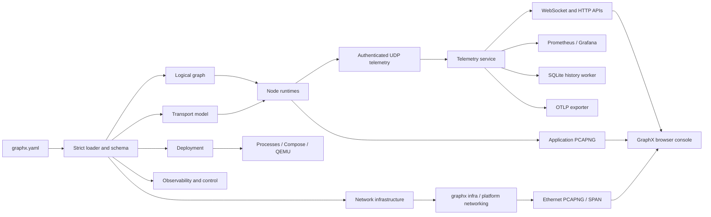
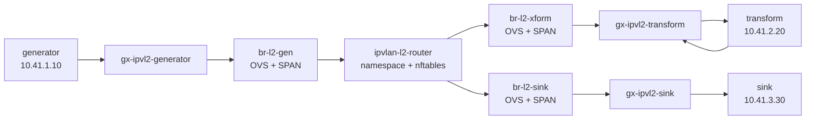
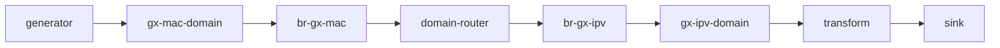
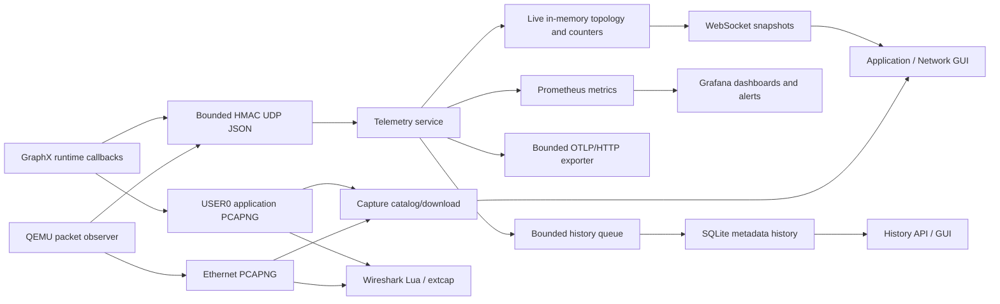

# GraphX Architecture and Network Topology

**Version:** 1.0  
**Repository baseline:** GraphX 1.0.0  
**Review date:** 2026-09-06  
**Status:** Living architecture document

## Executive summary

GraphX is an educational, configuration-driven framework for describing a directed processing graph once, running its nodes as processes, containers, or externally managed systems, and observing both application messages and the network paths that carry them. Its defining architectural choice is to keep several concerns related but distinct:

1. the **logical graph** says what processes data;
2. the **transport model** says how each edge communicates;
3. the **network-infrastructure model** says which L2/L3 devices and paths support that communication;
4. the **deployment model** says where nodes run and how they are packaged;
5. the **observability model** says what is measured, retained, exported, and captured; and
6. the **control and GUI plane** presents those models and applies narrowly scoped runtime commands.

The version-1 `graphx.yaml` file is the authoritative source for these views. The C++ loader and the telemetry service both validate and normalize it, while the browser derives its Application and Network views from the normalized topology instead of keeping a second topology definition.

GraphX supports five GraphX-aware transports—bounded in-process queues, TCP, Unix-domain sockets, POSIX shared memory, and IPv4 UDP—and also represents external raw TCP/UDP edges that GraphX observes but does not instantiate. The same canonical GraphX envelope and `u32be` frame are used by the stream transports, shared memory, UDP datagrams, application capture, and Wireshark tooling. Raw external edges use `framing: none` and are deliberately rejected by the GraphX transport factory.

Network infrastructure is a peer layer rather than an accidental consequence of Docker Compose. Its configuration can model Docker bridge, macvlan, and ipvlan networks; node interfaces; Open vSwitch bridges and ports; VLAN metadata; SPAN mirrors; namespace or container routers; routes; forwarding policies; and ordered per-edge network paths. Native Linux is the reference environment for exact macvlan, ipvlan, OVS system-datapath, namespace routing, nftables, and `tc netem` behavior. Docker Desktop uses a clearly labeled bridge/OVS userspace simulation where exact Linux semantics are impossible.

The QEMU examples prove a second important boundary: an application does not need to link GraphX or emit GraphX envelopes to appear in the topology. A shared x86_64 guest exchanges ordinary TCP and UDP traffic in two profiles: host-managed QEMU for macOS/Linux portability, and least-privilege containerized QEMU with optional KVM for native Linux. A passive packet observer converts network evidence into bounded live metrics, Ethernet PCAPNG, and separate packet-history records. The GUI displays logical nodes, network/runtime boundaries, accelerator evidence, protocol readiness, capture downloads, and history while restricting control to the origin generator.

Observability is intentionally best effort and bounded. Runtime events update live WebSocket topology, Prometheus metrics, rolling SLO state, optional OTLP export, optional SQLite metadata history, and capture correlation. GraphX application PCAPNG and standard Ethernet PCAPNG are complementary: the former explains envelopes; the latter explains the real network path. The GUI ties these artifacts together by edge identity, message identity where available, filenames, packet indexes, and capture offsets.

The architecture is suitable for reproducible laboratories and controlled demonstrations. Its present limits are equally important: configuration version 1 allows only DAGs; infrastructure provisioning is create/destroy rather than reconciliation; UDP is bounded but unreliable; multicast remains one logical producer-to-consumer edge; capture does not rotate automatically; OVS and application captures are not automatically cross-correlated; QEMU uses user-mode networking rather than TAP; and the telemetry/control system is a single-collector control domain rather than a distributed control plane.

## 1. Scope and architectural principles

This document consolidates the implemented architecture, accepted architecture decision records, checked-in examples, and current operational documentation. It describes implementation rather than aspirations unless a subsection is explicitly marked **Proposed**.

The design follows these principles:

- **One authoritative model.** `graphx.yaml` is executable configuration, not illustrative documentation.
- **Separation of concerns.** Logical topology, transport, infrastructure, deployment, observation, storage, and control are correlated without being collapsed into one layer.
- **Bounded resource use.** Queues, frames, datagrams, retries, history, capture, API work, and shutdown waits have explicit limits.
- **Fail closed at trust boundaries.** Invalid configuration, credentials, raw-edge transport requests, unsafe capture files, and unsupported QEMU accelerators are rejected.
- **Best-effort observation must not block data processing.** Telemetry, OTLP export, capture, and history degrade independently of graph execution.
- **Platform truthfulness.** Native Linux and Docker Desktop profiles are documented as different implementations where the platform cannot reproduce the same L2 behavior.
- **Evidence over inference.** VM acceleration, guest readiness, graph readiness, and service readiness are separate states with separate evidence.

## 2. Architectural evolution and decisions

The present design evolved through the following accepted decisions.

| Decision | Architectural effect | Current manifestation |
|---|---|---|
| Authoritative versioned configuration | Eliminated drift between descriptive YAML, runtime construction, and GUI topology | Strict config v1 model, JSON Schema, semantic validation, overrides, topology normalization |
| Network infrastructure as a peer layer | Separated logical edges from L2/L3 realization and Compose lifetime | `network` objects, `graphx infra`, external networks, edge paths, OVS/router laboratories |
| Typed receive outcomes and bounded runtime | Distinguished idle, peer completion, cancellation, and failure | `ReceiveResult`; bounded queues, deadlines, close wakeups, idempotent close |
| Envelope v2 identities | Added stable message, trace, and causal-parent identities without breaking v1 | v2 writers, v1/v2 readers, deduplication key, capture/telemetry correlation |
| Quality gates and fuzzing | Made malformed-input and lifecycle behavior a release concern | CTest, sanitizer, static-analysis, fuzz, package, security, and platform profiles |
| Explicit security boundaries | Separated data-plane TLS, telemetry authentication, observation, and control | TLS 1.3/mTLS, HMAC/replay checks, bearer roles, strict request limits, hardened containers |
| Centralized bounded operations telemetry | Kept remote exporter credentials out of nodes and distinguished service from graph health | Telemetry service OTLP, Prometheus, Grafana, SLO window, separate readiness endpoints |
| Isolated SQLite telemetry history | Added durable metadata without placing storage in the graph data path | Dedicated worker, bounded queues, retention, WAL, read-only observation API |
| Authorized runtime control plane | Replaced optimistic pause/resume with attributable, acknowledged commands | Policy principals, per-node identities, idempotency, expiry, audit, signed ACKs |
| Bounded PCAPNG, Lua, and extcap | Made captures operable and safer without changing the wire protocol | USER0 application capture, Ethernet capture, Lua dissector, validating live-follow extcap |
| Immutable release and compatibility surfaces | Established the 1.0.0 product/package contract | Authoritative `VERSION`, packages, manifests, checksums, SBOMs, compatibility policy |
| Bounded IPv4 UDP edges | Added unicast, broadcast, and multicast while retaining framing and bounds | UDP transport, typed anomaly counters, three focused examples |
| Unified QEMU profiles | Modeled raw network nodes consistently across host and Linux-container execution | Shared guest/observer/UI, external and container profiles, QMP and probe evidence |

The UDP decision is canonical ADR 0012 and the unified QEMU profiles decision is
canonical ADR 0013. The decision index records that QEMU was initially assigned
0012, preserving the historical mapping without retaining two current records
with the same number.

## 3. System context and architectural planes



### 3.1 Data plane

The data plane carries application work over a configured edge. GraphX-aware edges transport an `Envelope`; external edges carry protocol-native bytes and are descriptive/observable only. Data-plane execution is independent of the telemetry service: telemetry loss cannot stop a graph edge.

### 3.2 Infrastructure plane

The infrastructure plane realizes address domains, interfaces, switching, routing, filtering, mirroring, and impairment. It can be absent for local transports and simple Docker bridge deployments. Its lifecycle is explicitly separate from application deployment so external networks and network devices can survive Compose project restarts.

### 3.3 Observation plane

The observation plane receives normalized, bounded events, computes live state and derived signals, exports metrics/traces, persists optional metadata, and catalogs capture artifacts. It reports what the collector observed; best-effort UDP telemetry is not an accounting protocol.

### 3.4 Control plane

The control plane issues bounded commands to explicitly controllable nodes. Commands are authenticated, authorized, targeted, expiring, idempotent, and acknowledged. Pause stops a source from producing new messages while in-flight work drains; reset is collector-local; neither operation suspends a process or rewinds durable history.

### 3.5 Presentation plane

The React Flow browser console provides Application, Network, History, and capture/inspection experiences from the telemetry API and WebSocket stream. Prometheus and Grafana provide the operations-oriented view. Wireshark, TShark, and extcap provide packet/envelope analysis.

## 4. Authoritative configuration and deployment model

### 4.1 Configuration structure

Configuration version 1 is organized as follows:

| Surface | Purpose | Representative objects |
|---|---|---|
| `graph` | Logical computation | graph ID, nodes, typed ports, directed edges |
| `transport` | Per-edge communication | TCP, UDP, Unix, shared memory, in-process settings |
| `network` | L2/L3 realization and path | networks, interfaces, switches, routers, edge paths |
| `deployment` | Placement and packaging | service image, command, telemetry service/port |
| `observability` | Signals, export, capture, SLO, history, control limits | telemetry endpoint, PCAPNG, OTLP, SQLite, bounded command settings |

Unknown keys on core surfaces are rejected. Validation includes reference integrity, port direction/schema compatibility, transport/edge consistency, DAG constraints, addresses and subnet membership, MAC and VLAN syntax, mirror outputs, router attachments, and edge-path hops. A file is limited to 1 MiB; the model limits nodes, edges, and ports to bounded counts.

Overrides use dotted paths. Precedence is:

1. checked-in configuration file;
2. `GRAPHX_OVERRIDES`;
3. explicit CLI `--set` values.

Secrets do not belong in `graphx.yaml`. Compose secret mounts and deployment environment variables project observation tokens, control policies/tokens, runtime identities, shared HMAC secrets, TLS material, OTLP credentials, and optional organizational build trust.

### 4.2 Logical nodes and ports

A node has an ID, kind, runtime, execution location, lifecycle owner, control classification, optional accelerator and architecture, and typed input/output ports. These fields let the same GUI represent a GraphX process, Docker service, host program, or QEMU VM without pretending they have the same runtime contract.

An edge references `from` and `to` ports, a transport name, and a data-plane classification. Version 1 requires a directed acyclic graph because the current blocking startup/lifecycle model cannot safely schedule feedback cycles.

### 4.3 Deployment

Deployment metadata maps node IDs to images and commands. It never enters `Node`, `Edge`, or `Transport`. The standard demo runs generator, transform, sink, and telemetry as hardened Compose services on a private bridge. Network laboratories use separate Compose projects attached to external networks owned by the infrastructure lifecycle. QEMU changes the placement model without changing the logical application.

Common container defaults are read-only root filesystems, small tmpfs mounts, all capabilities dropped, `no-new-privileges`, PID limits, an init process, bounded logs, and loopback-only published management ports. Linux QEMU KVM mode adds only `/dev/kvm` and its group.

### 4.4 Lifecycle boundaries

The CLI validates and inspects configuration and plans network infrastructure. `graphx infra create`, `status`, and `destroy` manage host/network resources; Compose manages application services; QEMU demo scripts manage their own host or container VM resources. These owners must be stopped in dependency order: application workloads first, then external networks and host infrastructure.

Infrastructure provisioning is designed for clean laboratories. It does not persist desired state, reconcile drift, or guarantee rollback of every partial direct CLI create; the example launchers add preflight and cleanup behavior around this seam.

## 5. Logical graph and message protocol

### 5.1 Standard processing example

The root example is the canonical GraphX-aware pipeline:

```text
generator.samples -- TCP/u32be --> transform.samples
transform.transformed -- TCP/u32be --> sink.transformed
```

The generator creates `Sample` envelopes, the transform doubles the sample into `TransformedSample`, and the sink consumes it. This small graph is reused across bridge, shared-memory, macvlan, ipvlan, OVS, capture, telemetry, and GUI demonstrations so the transport or infrastructure change is visible without changing the application concept.

### 5.2 Envelope and framing

Every canonical GraphX frame is a four-byte unsigned big-endian length followed by a `GXE` envelope. The maximum envelope payload is 16 MiB for the stream protocol. Version 1 contains sequence, timestamp, type, legacy trace string, sorted attributes, and payload. Version 2 adds fixed 128-bit nonzero message and trace IDs plus an optional parent-message ID.

New roots emit v2. Readers accept v1 and v2. Normal forwarding, retry, and transformation retain message identity; explicit derivation creates a new message in the same trace with a causal parent. TCP complete-frame retry is at least once, so v2 `message_id` is the correct deduplication key.

### 5.3 Receive and shutdown semantics

Lifecycle-aware transports report `message`, `timeout`, `end_of_stream`, or `cancelled`. Protocol/transport failures remain contextual exceptions. Blocking operations have deadlines, `close()` is idempotent, and a control thread may close a transport to wake a blocked operation. The caller must keep the object alive until the operation returns.

## 6. Transport architecture

| Transport | Scope and representation | Backpressure/lifecycle | Main limitations | Example |
|---|---|---|---|---|
| In-process | One bounded mutex-protected FIFO per named channel | Block-with-deadline or immediate reject; FIFO drain; close wakes waiters | One process; endpoint settings must match | Configuration profile and unit tests |
| TCP | Cross-process/host framed byte stream; optional TLS 1.3/mTLS | Bounded connect/write; reconnect and exponential retry; typed receive | Retry is at least once; blocking runtime | Standard demo, all L2/L3 pipeline labs |
| Unix-domain socket | One-host framed stream | Nonblocking listener construction; timed accept/connect/write; cancellation socket | One listener peer for v1; local filesystem ownership | Transport tests/documented profile |
| Shared memory | POSIX mapped SPSC ring containing exact framed bytes | Fixed slots; block/reject; peer-PID checks; robust mutex on Linux | One producer/consumer; copy-based; IPC namespace considerations | `examples/shared-memory` |
| UDP | One framed envelope per IPv4 datagram | Bounded buffers/datagram; invalid datagrams dropped; cancellation socket | Loss, duplicates, reordering; no ACK, security, congestion control, or EOS | Unicast, broadcast, multicast examples |
| External raw TCP/UDP | Descriptive protocol-native bytes, `framing: none` | Owned by external application/profile | Not constructible by `TransportFactory`; passive evidence only | Both QEMU profiles |

### 6.1 TCP and security

TCP edges may enable TLS 1.3 and mutual TLS with CA, certificate, key, peer verification, client-certificate requirement, and server-name settings. Complete framed writes are bounded. A failed send may reconnect and retry the complete frame once. Control traffic that requires reliability and authentication should use TLS-protected TCP rather than GraphX UDP.

### 6.2 UDP modes

- **Unicast:** one IPv4 destination; the example uses loopback and five 1,400-byte-bounded messages.
- **Broadcast:** enables `SO_BROADCAST`; the portable example confines traffic to an internal Docker subnet, and native Linux acceptance uses two disposable namespaces on a bridge with no physical interface or default route.
- **Multicast:** joins/transmits in `224.0.0.0/4`; the example uses `239.255.42.1`, loopback, TTL 0, and address reuse. A diagnostic listener proves network fan-out, but the logical graph still has one subscriber.

Each datagram retains `u32be + GXE` so the decoder, application capture, and Lua dissector remain reusable. Frames are never fragmented by GraphX, although IP itself may fragment a large datagram. The implementation counts malformed, truncated, oversized, socket-error, sequence-gap, duplicate, and out-of-order events.

## 7. Network topology and infrastructure configuration

### 7.1 Why logical edges and network paths differ

A logical edge states application intent: producer port, consumer port, schema, and transport. A network path states realization: interfaces, address domains, switches, routers, and policy hops. One edge may traverse several infrastructure devices; several edges may share one network. Keeping both views prevents Docker membership from being mistaken for application connectivity.

The GUI correlates them through `network.edge_paths`, an ordered list whose first and last hops are the edge endpoints and whose intermediate hops reference configured infrastructure objects.

### 7.2 Network objects

| Object | Configuration responsibilities | Operational realization |
|---|---|---|
| Network | ID, driver, one/more subnets, gateway, parent, mode, ownership | Docker bridge/macvlan/ipvlan network |
| Node interface | Owner, network, IP/prefix, optional MAC | Container interface/IPAM attachment |
| OVS switch | Bridge ID, datapath, ports, veth peer, VLAN access/trunk metadata, optional mirror | OVS bridge/ports and SPAN configuration |
| Router | Namespace/container kind, interfaces, addresses, forwarding, routes, policies | Linux netns or router container; IP forwarding and nftables |
| Edge path | Logical edge ID and ordered hops | Presentation/inspection correlation |
| Fault | Router/interface and delay, jitter, loss, optional rate | `tc netem` qdisc |

The loader validates IPv4 subnet membership, MAC syntax, VLAN ranges, references, mirrors, and path connectivity before infrastructure commands run. Plans execute argument arrays without a shell and can be reviewed with `--dry-run`.

### 7.3 Docker bridge

The root demo uses one private bridge (`172.30.0.0/24`) with service-name DNS. It is the most portable container topology and requires no host privileges. It demonstrates application topology and transport behavior but does not expose unique LAN-visible MAC identities, independent routing domains, or host OVS switching.

### 7.4 Macvlan L2

The macvlan example attaches generator, transform, and sink to one `10.30.0.0/24` domain using explicit addresses and MACs. An isolated dummy parent prevents contact with the physical LAN. This demonstrates LAN-like per-container L2 identities and the important macvlan rule that a parent host cannot directly contact its macvlan children without a host-side macvlan shim.

Macvlan is native-Linux behavior. It is not supported by Docker Desktop for macOS.

### 7.5 IPvlan L2

The IPvlan L2 example creates three independent `/24` networks. Each Docker parent is connected to its own OVS bridge; a namespace router connects the bridges and allows only generator-to-transform and transform-to-sink policy flows. Each OVS bridge has a dedicated SPAN port.



This topology makes switching, routing, security policy, fault injection, and observation points explicit. It is particularly useful when testing where packet loss or a route/policy error occurs.

### 7.6 IPvlan L3

The IPvlan L3 example uses one Docker IPvlan network with three repeated subnet definitions: `10.42.1.0/24`, `10.42.2.0/24`, and `10.42.3.0/24`. Docker permits only one IPvlan network to claim a parent, so the supported design places all L3 subnets on one network/parent. No gateway is specified: IPvlan L3 installs device routes and does not provide L2 broadcast between subnets.

Remote systems need routes to each subnet through the Docker host when the isolated parent is replaced by a physical interface.

### 7.7 Mixed macvlan/ipvlan with OVS and routing

The mixed reference topology demonstrates a full cross-domain path:



```text
generator 10.10.0.10 / explicit MAC
  -> gx-mac-domain (macvlan L2)
  -> br-gx-mac (OVS system datapath + SPAN)
  -> gx-router (10.10.0.1 and 10.20.0.1, forwarding, nftables, netem)
  -> br-gx-ipv (OVS system datapath + SPAN)
  -> gx-ipv-domain (ipvlan L2)
  -> transform 10.20.0.20
  -> sink 10.20.0.30
```

The first logical edge crosses both domains; the second remains inside the IPvlan domain. This contrast shows why each logical edge owns a distinct `edge_path`. The two application domains are separate Compose projects and do not own the external networks.

### 7.8 Switching, VLANs, mirrors, policies, and faults

Only Open vSwitch is presently modeled. Ports may identify a host interface/veth peer and carry access-tag or trunk metadata. A switch can mirror all selected traffic to an output port. Standard Ethernet capture should occur on those SPAN interfaces, not through the GraphX application capture writer.

Routers can be Linux namespaces or containers. They expose named interfaces, routes, forwarding, and backend-neutral source/destination/action policies realized with nftables in the native implementation. `tc netem` can apply bounded delay, jitter, loss, and rate behavior to a selected router interface; it is an operational action, not a permanent graph property.

### 7.9 Native Linux versus Docker Desktop

| Capability | Native Linux reference | Docker Desktop/macOS profile |
|---|---|---|
| Docker macvlan/ipvlan | Exact kernel drivers | Unsupported; substituted with bridge networks |
| OVS datapath | Host system datapath | Privileged container, `datapath_type=netdev` |
| Router | Linux namespace | Router/OVS container |
| Host veth/netns | Directly available | Inside Docker Desktop VM/container boundary |
| SPAN capture | Host capture interfaces | Capture inside OVS container |
| Semantics | Acceptance reference | Routing/OVS/inspection simulation |

The portable profile remains useful for GUI, routing, mirror, nftables, and fault demonstrations, but it must not be used as evidence for native macvlan/ipvlan semantics or performance.

## 8. QEMU connectivity architecture

### 8.1 Logical contract

Both profiles use the same three logical nodes and four raw edges:

```text
                 TCP :18001
host-origin  ----------------->  qemu-node
     |                               |
     +----------- UDP :18001 ------> |
                                     |
                 TCP :19001          v
host-receiver <----------------- qemu guest application
host-receiver <------ UDP :19001
```

The guest does not link GraphX and does not exchange GraphX envelopes. Edges are `data_plane: external` with `framing: none`; they are validated and visualized but cannot be instantiated by `TransportFactory`. This is the pattern for incorporating a pre-existing network appliance, VM, SDR, or hardware node into a GraphX topology without rewriting it.

### 8.2 Shared guest and evidence

Both profiles use the same reproducible Buildroot x86_64 guest, kernel, root filesystem, `qemu-network-node` application, deterministic host peers, packet observer, telemetry service, and browser. Startup verifies an artifact manifest and records SHA-256 hashes.

QMP and application probes answer different questions:

- QMP `query-status` proves VM execution state.
- QMP `query-kvm` proves whether KVM is present and enabled.
- Separate TCP and UDP probes on private port 18002 prove the guest application is responding.
- Data-plane traffic remains on port 18001 and cannot be consumed by readiness probes.

The GUI reports requested, launcher-selected, and QMP-proven accelerators separately. Runtime states include `not-started`, `booting`, `ready`, `degraded`, `stopped`, and `unavailable`. A QMP-paused VM remains visible as paused while the guest and protocol probes become unavailable; fresh probes restore readiness after resume.

### 8.3 External QEMU profile

In the portable profile, QEMU and the packet observer run on the host; origin, receiver, telemetry, and GUI run in Docker. Host-side observation avoids Docker Desktop bind-mount cache delay while a PCAP is growing.

Origin reaches the guest through a QEMU host forward at `host.docker.internal:18001`. The guest reaches the receiver at the slirp gateway `10.0.2.2:19001`. On macOS, Docker Desktop provides `host.docker.internal` and host services bind to loopback. On Linux, the hostname is pinned to the private `172.30.12.1` demo bridge gateway, and QEMU forwards plus the observer history API bind there rather than on a physical interface.

QMP is a private Unix socket in a mode-0700 state directory, used for evidence and graceful shutdown. Explicit KVM or HVF requests fail rather than silently falling back. Apple Silicon runs the x86_64 guest with TCG; HVF applies only to Intel macOS; Linux can select KVM when available.

### 8.4 Containerized QEMU profile

The Linux-only profile runs origin, receiver, QEMU, observer, telemetry, and GUI as Compose services. QEMU user-mode networking remains the common guest contract. A bounded relay in the QEMU container forwards guest egress from `10.0.2.2:19001` to the receiver service, preserving the guest image used by the external profile.

The default profile is unprivileged: read-only root, no Docker socket, no `NET_ADMIN`, no `/dev/net/tun`, no added capabilities, and a non-root UID/GID. KVM is an overlay that adds only `/dev/kvm` and the host KVM group. The private QMP socket lives in a mode-0700 tmpfs and is not shared with telemetry or the observer.

### 8.5 QEMU capture and history

QEMU produces a bounded source PCAP. The shared passive observer tolerates an incomplete final record, rejects impossible lengths/timestamps, skips bounded malformed records, and converts valid packets to standard Ethernet PCAPNG. It also emits `network_packet` telemetry and stores packet metadata in a separate SQLite history service.

Defaults are 64 MiB/100,000 PCAPNG packets, a 64 MiB source PCAP ceiling, 50,000 history records, one-day retention, a 64 MiB packet-history database, and a 64-byte payload preview. Reaching the source-capture limit stops QEMU instead of permitting unbounded storage. Payload preview is bounded metadata, while the downloadable capture contains packet bytes and must be protected accordingly.

### 8.6 Deferred QEMU network modes

TAP/bridge networking, guest multicast/broadcast, physical-network attachment, direct guest control, and guest-native GraphX integration are not implemented. These are sensible future profiles, but each would require a new security and lifecycle decision rather than an incidental Compose change.

## 9. Observability, metrics, history, capture, and GUI

### 9.1 End-to-end information flow



### 9.2 Live telemetry and GUI behavior

GraphX-aware runtimes publish send, receive, error, connection, reconnect, backpressure, processing, heartbeat, and UDP anomaly events. QEMU observation publishes explicitly typed `network_packet` events. The telemetry service normalizes topology from the same configuration and broadcasts bounded snapshots over WebSocket. The browser initially fetches `/api/topology`, then updates without refresh over the configured WebSocket path.

The GUI surfaces:

- **Application:** logical nodes, ports, edges, connection/runtime state, live counters, rate, latency, errors/drops, and recent correlated messages or packets.
- **Network:** infrastructure nodes and ordered edge paths; for QEMU, distinct host/container, VM, guest-application, and TCP/UDP readiness layers.
- **History:** newest-first bounded metadata with filters and cursors. Paging away from the newest page pauses live refresh until the operator returns.
- **Capture:** cataloged capture files and edge-oriented downloads. Application and Ethernet files are labeled by their actual DLT/representation.
- **Control:** control credential entry, permitted actions, command state, and acknowledgements. QEMU itself is shown as non-controllable; only the configured origin is paused/resumed.

Changing views does not alter the authoritative topology; layout is recalculated from the current model. Live count updates depend on WebSocket connectivity and observation authorization, while manual refresh uses the HTTP snapshot.

### 9.3 Metrics and SLOs

Per-edge metrics include messages and bytes by direction, five-second send rate, histogram-derived p95 receive latency, errors, drops, rejects, reconnects, backpressure events/time, connection state, and UDP anomaly counters. Per-node heartbeat events report CPU use as a percentage of one core.

The telemetry service distinguishes process liveness (`/api/live`), service readiness (`/api/ready`), graph readiness (`/api/graph/ready`), compatibility health (`/api/health`), and current SLO (`/api/slo`). Docker health uses service readiness so an application outage remains observable instead of restarting the collector.

The default SLO window is 300 seconds with a 10-second warm-up, 99% graph availability, maximum 1% error and drop ratios, and maximum 10 ms p95 latency. Status is `warming`, `met`, or `violated`. The window is in memory; durable history stores prior evaluations but does not replay them into a restarted live window.

Prometheus is the operations contract. The provisioned Grafana dashboard covers readiness, SLO, throughput, latency, errors/drops, CPU, OTLP, history, and control. Alerts cover sustained unavailability, SLO violations, exporter loss, history failure, invalid control policy, and command timeout.

### 9.4 OTLP export

The native C++ exporter is an optional bounded loopback-only seam. Remote OTLP belongs at the telemetry service, where HTTPS, bearer authentication, private CA, and optional mutual TLS can be configured without distributing exporter credentials to graph nodes.

Queues are bounded by count and encoded bytes. Requests have absolute deadlines, capped responses, bounded exponential retry with jitter, and retry only for selected connection/HTTP failures. Export remains best effort and does not replace durable history. GraphX v2 trace IDs map directly to OTLP trace IDs; each operation receives a fresh span ID. Full SDK behavior, W3C propagation, sampling, and span-parent construction remain outside the current adapter.

### 9.5 Durable history

SQLite history is optional in the core model and enabled by default by the guided demo with smaller limits. A dedicated Node worker exclusively owns the database. The main event loop communicates through bounded write/query queues; it never performs SQLite work directly. WAL mode, full synchronous durability, batching, age/count retention, database page bounds, query limits/deadlines, and bounded shutdown are explicit.

History stores metadata such as graph/event/node/edge IDs, sequence, trace/message IDs, latency, bytes, CPU, SLO evaluations, and authorized control-audit records. It excludes application bodies, capture contents, and configured credentials. Backend state (`starting`, `ready`, `degraded`, `closed`) is independent from service readiness. Overload drops newest history offers and increments a metric rather than blocking the telemetry loop.

QEMU packet history is intentionally separate from GraphX message history. It preserves protocol/address/length/truncation and bounded preview fields without claiming that raw packets were GraphX envelopes.

### 9.6 Application PCAPNG

The GraphX capture sink writes one file per node using PCAPNG `LINKTYPE_USER0` (147). Each Enhanced Packet Block contains the exact canonical `u32be + GXE` frame and a bounded JSON comment with edge, direction, wire version, sequence, message/parent/trace IDs, and type. The matching telemetry capture event carries filename, packet index, and byte offset.

Files have explicit snap, byte, and packet limits. Complete blocks are committed atomically. Unsafe symlinks, hard links, special files, truncation races, and unsupported DLTs are rejected through descriptor-based validation. Capture failure stops capture for that process, not graph traffic. There is no automatic rotation; a new directory or operator-managed archive is required.

### 9.7 Ethernet PCAPNG and OVS capture

`EthernetPcapngCaptureSink` and the QEMU observer write actual IEEE 802.3 frames with `LINKTYPE_ETHERNET` (1). Native network labs use OVS SPAN interfaces with `tcpdump` for live inspection or `dumpcap` for PCAPNG. These files explain routing, switching, VLAN, retransmission, broadcast/multicast, and impairment behavior that application capture cannot show.

Application and Ethernet captures are complementary, not interchangeable. Automated packet matching between them is not implemented. Today the operator correlates using time, edge/path, identities where available, endpoints, and visible payload/protocol attributes.

### 9.8 Wireshark, TShark, and extcap

The Lua dissector self-registers on USER0 and decodes v1/v2 GraphX frames with boundary checks, identity checks, unique attribute keys, and expert diagnostics. It should be installed in a GraphX-specific profile because USER0 is private-use and can conflict with another local protocol.

The Python extcap adapter exposes separate GraphX application (DLT 147) and Ethernet (DLT 1) interfaces. It validates PCAPNG sections, a single interface, block sizes/trailers, DLT, and complete blocks before copying or following a file. It rejects unsupported capture filters; display filters belong in Wireshark. The QEMU inspection helper streams captures to TShark to work around confined Linux packages that reject direct workspace paths.

### 9.9 Security and access relationship

Observation and control are separate credentials. Observation protects topology details, WebSocket data, metrics, history, capture catalog/downloads, and SLO state when configured. Control principals have explicit node/action scopes and separate audit permissions. Telemetry datagrams and runtime acknowledgements use HMAC with replay and clock checks; policy mode gives each node a distinct runtime secret.

Credential rotation uses atomic current snapshots plus a bounded redaction-only overlap. Retired credentials never authenticate. Input is normalized before fan-out to live state, OTLP, capture metadata, history, audit, or logs. Raw capture payloads are not sanitized and require stronger operational protection than metadata telemetry.

## 10. Example-to-concept map

| Example | Architectural concepts illustrated | Platform/privilege |
|---|---|---|
| Standard TCP Docker demo | Authoritative config, DAG, framed TCP, service DNS, live GUI, control, capture, history | Docker Desktop or Linux; unprivileged |
| Standalone capture | Application PCAPNG, correlation comments, USER0/Wireshark | Local build; unprivileged |
| Shared memory | Separate processes, bounded SPSC rings, local IPC lifecycle/backpressure | Linux/macOS; unprivileged |
| UDP unicast | One framed envelope per datagram, loss-tolerant semantics | Loopback; unprivileged |
| UDP multicast | Local multicast membership and diagnostic fan-out | Loopback; unprivileged |
| UDP broadcast | Isolated directed broadcast; native namespace proof | Docker portable; privileged native Linux acceptance |
| Macvlan | Explicit L2 IP/MAC identity and parent isolation | Native Linux; privileged infrastructure |
| IPvlan L2 | Independent L2 domains, OVS bridges/SPAN, namespace routing/policy | Native Linux; privileged infrastructure |
| IPvlan L3 | Multi-subnet single-parent IPvlan L3, broadcast-free routing | Native Linux; privileged infrastructure |
| Mixed network | Cross-driver routing, OVS, mirrors, nftables, netem, edge paths | Native Linux exact; macOS simulation |
| External QEMU | External raw node, host QEMU, slirp, passive observation, portable GUI | macOS/Linux; host QEMU + Docker |
| Container QEMU | Nested VM deployment, KVM/TCG evidence, least privilege, packet history | Linux x86_64; optional `/dev/kvm` |

## 11. Architectural limits, drift, and risks

### 11.1 Current limits

- Configuration v1 rejects cycles and native one-to-many graph edges.
- Infrastructure tooling does not reconcile state or persist ownership metadata.
- UDP supports IPv4 only and provides no DTLS, retransmission, congestion control, fragmentation/reassembly, or peer authorization.
- Shared memory is SPSC, fixed-size, copy-based, and sensitive to IPC namespace design.
- Unix-domain transport accepts one peer for its v1 listener lifetime.
- Telemetry and control are single-collector; pending commands do not survive restart.
- Capture stops at its limit; it does not rotate, index, or enforce an external retention workflow.
- GraphX application PCAPNG uses private USER0 and requires a dedicated Wireshark profile.
- OVS Ethernet and GraphX application captures are not automatically correlated.
- QEMU user networking does not model TAP, physical L2, multicast/broadcast through the guest, or guest control.
- Docker Desktop network labs are simulations, not native-Linux acceptance evidence.

### 11.2 Documentation and model consistency

- The UDP decision is canonical ADR 0012 and the QEMU decision is canonical ADR 0013; the ADR index retains the historical collision note.
- Top-level projection files under `config/` are explicitly non-authoritative and are generated or checked with `graphx project` from validated `graphx.yaml`.
- Root documentation identifies GraphX 1.0.0 and distinguishes accepted Phase 3–12 reports from the Phase 1 and Phase 2 documentary gaps.
- Some examples provide live GUI metrics while topology-only examples provide only static visualization; the distinction should remain visible in every example README.
- Infrastructure `routes` exist in the model but most checked-in network labs rely on directly connected router subnets and policies. A focused static-route example would improve coverage.

## 12. Proposed additional examples

The following are proposals, not current capabilities.

### 12.1 Single SDR → switch → processor → sink

**Priority: high.** Model one external Ethernet-connected SDR sending UDP IQ/sample blocks to one containerized processor, with a TLS/TCP control edge back to the SDR and a result edge to a sink. Place an OVS switch and SPAN port on the data path. This is the smallest example that combines the user’s SDR goal with external raw edges, mixed UDP/TCP semantics, Ethernet PCAPNG, packet history, and the GUI without introducing a large topology.

Recommended staging:

1. simulated SDR container using raw UDP data and TCP control;
2. external physical-SDR profile using the same logical model;
3. optional QEMU-based SDR emulator profile.

### 12.2 Routed multicast receiver set

**Priority: high.** Extend the multicast laboratory across two subnets with an IGMP-aware OVS/router setup and multiple diagnostic receivers. Keep the logical edge limitation explicit at first, then use the example as acceptance evidence for a future one-to-many graph-edge ADR.

### 12.3 Static routes and deny-policy laboratory

**Priority: medium.** Create three routed domains where one intended flow succeeds, one is denied by policy, and one initially fails until an explicit static route is added. Expose the edge paths and OVS mirrors in the GUI. This would exercise currently underrepresented route configuration and make network troubleshooting teachable.

### 12.4 Dual capture correlation laboratory

**Priority: medium.** Run the standard TCP pipeline across OVS while recording both GraphX USER0 frames and Ethernet frames. Generate a correlation report keyed by message ID, timestamp window, edge, endpoint, and frame length. This would prototype the currently deferred automated cross-file matching.

### 12.5 QEMU TAP profile

**Priority: later.** Add a native-Linux-only QEMU TAP/OVS profile after a dedicated security/lifecycle ADR. It would enable real guest MAC identity, VLANs, L2 multicast/broadcast, and direct SPAN capture, but requires `NET_ADMIN`/TAP handling and stronger cleanup/ownership controls than the current slirp profile.

### 12.6 Degraded observability laboratory

**Priority: later.** Intentionally fill history queues, reach capture limits, interrupt OTLP, rotate credentials, and sever graph edges while proving that graph traffic, service readiness, graph readiness, SLO status, and GUI diagnostics remain distinct.

## 13. Recommended architectural roadmap

### Completed documentation and consistency foundation

1. The QEMU decision is ADR 0013, with its former number recorded in the canonical ADR index.
2. Root maturity wording matches 1.0.0 and qualifies the accepted Phase 3–12 verification record.
3. Root and contributor documentation link the architecture source, editable DOCX, ADR index, and focused references.
4. `graphx project` generates or verifies the four projections under `config/`; CTest enforces the drift check in local and Linux/macOS CI builds.

### Near-term architectural examples

1. Implement the single-SDR example in simulated and external profiles.
2. Add the static-route/deny-policy network laboratory.
3. Add an application/Ethernet dual-capture correlation prototype.
4. Decide whether one-to-many logical edges belong in config v1 extension rules or require config v2.

### Later platform capabilities

1. Define reconcile/rollback/ownership semantics for infrastructure before expanding beyond laboratories.
2. Decide capture rotation, indexing, retention, and cross-capture correlation contracts.
3. Define a QEMU TAP/OVS security model and physical-node attachment boundary.
4. Evaluate IPv6 and authenticated UDP/DTLS only with explicit compatibility and threat-model decisions.
5. Define distributed telemetry/control state only if multi-collector availability becomes a requirement.

## Appendix A. Authoritative source map

| Concern | Primary implementation or documentation evidence |
|---|---|
| Architecture decisions | `docs/adr/README.md`, with records `docs/adr/0001-*.md` through `docs/adr/0013-*.md` |
| Configuration model | `include/graphx/config.hpp`, `include/graphx/network.hpp`, `src/config.cpp`, `config/schema/graphx.schema.json` |
| CLI/infrastructure | `apps/cli/main.cpp`, `include/graphx/infra.hpp`, `src/infra.cpp` |
| Envelope/framing | `include/graphx/envelope.hpp`, `src/envelope.cpp`, `src/framing.cpp`, `docs/protocol.md` |
| Transport abstraction | `include/graphx/transport.hpp`, `src/transport_factory.cpp`, transport-specific headers/sources/docs |
| Runtime nodes | `apps/generator/main.cpp`, `apps/transform/main.cpp`, `apps/sink/main.cpp`, `apps/common.hpp` |
| Telemetry/control/history | `apps/telemetry/server.mjs`, `operations.mjs`, `control.mjs`, `history.mjs`, `history-worker.mjs` |
| Browser GUI | `web/src/App.jsx`, `web/src/useTelemetry.js`, `web/src/components`, `web/src/data/topology.js` |
| Capture/Wireshark | `src/capture.cpp`, `apps/telemetry/capture-files.mjs`, `wireshark/graphx.lua`, `tools/graphx-extcap` |
| Operations stack | `compose.observability.yaml`, `deploy/observability` |
| Standard deployment | `graphx.yaml`, `compose.yaml`, `compose.history.yaml`, `scripts/demo.sh` |
| Network laboratories | `examples/macvlan`, `examples/ipvlan-l2`, `examples/ipvlan-l3`, `examples/mixed-network` |
| UDP examples | `examples/udp-unicast`, `examples/udp-broadcast`, `examples/udp-multicast` |
| QEMU profiles | `examples/qemu-node`, `docs/qemu-demos.md` |
| Verification status | `verification_status.md`, `phase_3_verification.md` through `phase_12_verification.md` |

## Appendix B. Terminology

| Term | Meaning in GraphX |
|---|---|
| GraphX edge | Directed logical connection between typed node ports |
| Network path | Ordered infrastructure hops realizing or describing an edge |
| GraphX data plane | Edge whose runtime carries canonical GraphX envelopes |
| External data plane | Edge represented by GraphX but implemented by another system |
| Application capture | USER0 PCAPNG containing canonical GraphX frames |
| Ethernet capture | Standard link-layer PCAPNG from OVS, QEMU, or another L2 source |
| Service readiness | Telemetry listeners/configuration are ready |
| Graph readiness | All configured nodes are fresh/running and all edges connected |
| VM readiness | QMP proves VM state/acceleration |
| Guest readiness | Independent TCP and UDP probes prove guest application response |
| Observation credential | Read access to topology, live telemetry, metrics, history, and captures |
| Control principal | Scoped identity allowed to issue/read commands or audit |

## Appendix C. Document maintenance rules

Update this document when an ADR changes an architectural boundary; a configuration surface is added; a new transport, network device, runtime type, exporter, history store, capture format, GUI view, or example is introduced; or a platform-support statement changes. Keep implemented and proposed material visibly separated. Validate example paths and configuration names against the repository before release, and regenerate the DOCX after every material Markdown revision.
