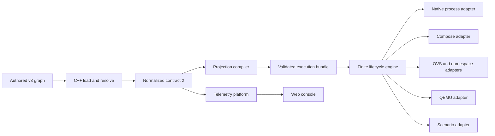

# GraphX simplification report

Date: 2026-09-14

Implemented baseline (2026-09-20): ordinary development builds are code-only;
aggregate artifacts use the explicit `graphx artifacts build` workflow; per-example
CMake lifecycle targets and cache settings are removed; LLVM 21 selection is shared;
and execution dispatch reads an explicit mode from the hashed execution plan. The
remaining projection-model and shared lifecycle work below is intentionally staged.

## Purpose

This report identifies ways to reduce implementation and operational complexity
without removing supported behavior or weakening GraphX's security and ownership
contracts. It treats `docs/project-decisions.md` as authoritative and evaluates the
maintained source tree rather than generated `build/`, `outputs/`, or `captures/`
content.

The recommendation is evolutionary: keep the current languages, authored version 3,
normalized contract 2, system OVS backend, execution targets, and fail-closed resource
ownership. Simplify the paths between those stable boundaries.

## Executive assessment

GraphX has essential domain complexity: it compiles one graph into native, container,
OVS, QEMU, credential, telemetry, and scenario artifacts, then mutates privileged
resources under stable identity. Most of that complexity cannot safely disappear.

The avoidable complexity is concentrated in three places:

1. Executors re-derive decisions that the compiler already made.
2. Lifecycle sequencing is distributed across large native, Compose, OVS, QEMU, and
   workflow coordinators even though they share one ownership model.
3. Build and verification registration obscures the product architecture and repeats
   process-running and fixture conventions.

A measured source inventory found about 39,600 lines across C++, Python, JavaScript,
JSX, and shell. The largest maintained implementation files include:

| File | Approximate lines | Architectural role |
| --- | ---: | --- |
| `src/config_v3.cpp` | 994 | Authoritative resolution and validation |
| `src/infra/lifecycle_coordinator.cpp` | 966 | OVS resource lifecycle |
| `src/infra/compose_execution.cpp` | 933 | Container and privileged execution |
| `src/observability.cpp` | 798 | Application telemetry behavior |
| `src/infra/ownership_state.cpp` | 739 | Persistent ownership state |
| `scripts/example_cli.py` | 634 | User workflow and environment dispatch |
| `src/compile.cpp` | 628 | All artifact projections |
| `apps/telemetry/control.mjs` | 623 | Authenticated control boundary |

The size is not itself a defect. It is evidence that a small number of files combine
policy selection, validation, sequencing, platform adaptation, and presentation. The
best simplifications separate those reasons to change while retaining current public
contracts.

## Constraints that should not be simplified away

The following are load-bearing design decisions:

- Keep one authored format (`graphx.yml`, version 3) and one authoritative C++ loader.
- Keep normalized contract 2 as the only telemetry configuration input.
- Keep independent validation at trust boundaries. A digest proves integrity, not
  semantic compatibility, so telemetry should continue validating normalized JSON.
- Keep system OVS as the only managed data-plane backend. MACVLAN and IPVLAN remain
  semantic profiles.
- Keep Compose limited to processes and management connectivity; owned veth, TAP,
  namespace, nftables, netem, capture, and QEMU behavior stays in the Linux boundary.
- Keep stable identity checks, exclusive locks, bounded I/O, and fail-closed cleanup.
- Keep explicit scenario actions and explicit privileged authorization.
- Keep platform-specific evidence separate. A portable or TAP-plan test is not proof
  of privileged Linux, Lima, TCG, or KVM execution.

These constraints explain why replacing the loader with several language-specific
readers, introducing YAML inheritance, accepting arbitrary Compose fragments, or
merging all processes into one service would make the system simpler only on paper.

## Recommended target shape

The target has four explicit responsibilities:

1. **Resolve:** interpret authored configuration and catalog capabilities once.
2. **Project:** produce deterministic artifacts from the resolved graph.
3. **Execute:** consume validated plans through one finite lifecycle protocol.
4. **Observe:** independently validate normalized input and expose bounded runtime
   evidence.

The main change is not a new service. It is making the generated plan authoritative
for execution choices instead of allowing each executor to infer those choices again
from incidental normalized fields.

## Ranked recommendations

### 1. Make the execution bundle authoritative

**Priority:** highest  
**Value:** high  
**Risk:** medium

`src/compile.cpp` emits `execution-plan.json`, `native-plan.json`, `compose.yaml`,
`ovs-plan.json`, `qemu-plan.json`, `scenario-plan.json`, and supporting manifests.
`src/execution.cpp` nevertheless selects native versus Compose by testing whether the
telemetry host is `127.0.0.1`, reconstructs a partial `GraphConfig` for plan output,
and reads the normalized graph again to determine adapter availability. Compose and
privileged coordinators perform additional interpretation.

This creates two representations of execution intent: generated plans and executor
branching logic. It also makes a telemetry address carry an unrelated placement
decision.

Simplify to one small, versioned execution-bundle reader:

- Add an explicit execution mode and ordered adapter inventory to
  `execution-plan.json`.
- Validate every referenced plan against the compile manifest before any mutation.
- Let `execute_graph` dispatch from that validated inventory.
- Pass typed, already-validated plan values to native, Compose, OVS, QEMU, capture,
  and scenario adapters.
- Stop reconstructing configuration or inferring execution mode from telemetry and
  network fields inside executors.

Do not put secrets or runtime owner identities in the bundle. Substitutions remain
execution-time values and existing artifact hashes remain the publication boundary.

**Deletion target:** executor-side placement inference and repeated artifact lookup,
not the plan-specific safety checks.

**Acceptance:** compiled fixtures remain deterministic; malformed, missing, extra, or
hash-mismatched plan members fail before locks, processes, Docker, or privileged tools
are invoked.

### 2. Use one lifecycle transaction protocol

**Priority:** highest  
**Value:** high  
**Risk:** high

The repository already has the right primitives: `OwnershipState`, `OwnershipLock`,
creation intents, stable resource identities, and resource-specific adapters. The
remaining complexity comes from native startup in `src/execution.cpp`, Compose
coordination in `src/infra/compose_execution.cpp`, and OVS coordination in
`src/infra/lifecycle_coordinator.cpp` each owning substantial sequencing and rollback
logic.

Introduce one internal transaction protocol around the existing ledger:

1. preflight all immutable inputs and identities;
2. acquire the graph lock;
3. record an intent before each mutation;
4. apply a resource-specific operation;
5. record the observed stable identity;
6. compensate completed operations in reverse order on failure;
7. retain state whenever identity is ambiguous or mismatched.

Adapters should remain concrete. A small operation record with `prepare`, `apply`,
`inspect`, and `compensate` behavior is preferable to a general orchestration
framework. Native processes, Compose projects, OVS resources, captures, namespaces,
and guests have different identity checks and should not be forced behind a weak
least-common-denominator API.

**Deletion target:** duplicated state transitions, interruption handling, reverse
iteration, and status formatting across coordinators.

**Acceptance:** all current interruption and ownership-negative tests pass; injected
failure after every mutation either removes only newly owned resources or retains
sufficient evidence for explicit recovery.

### 3. Split policy selection from artifact rendering

**Priority:** high  
**Value:** medium-high  
**Risk:** medium

`src/compile.cpp` currently performs capability checks, credential consumer analysis,
node command construction, service hardening, network projection, Grafana/Prometheus
projection, guest projection, execution staging, and manifest generation in one
translation unit.

Keep `compile_graph` as the public pure function, but organize its internals around a
single immutable projection model:

- `compile_model`: selected target, execution mode, nodes, platform, credentials,
  networks, guests, scenarios, and extensions;
- `project_nodes`: node JSON and native process records;
- `project_compose`: Compose services and management networks;
- `project_infrastructure`: OVS, capture, namespace, QEMU, and scenario plans;
- `project_platform`: platform, Prometheus, and Grafana artifacts;
- `publish_manifest`: substitutions, catalog pins, hashes, and compile manifest.

Each projection should return files and diagnostics without reading the filesystem or
mutating infrastructure. Avoid a renderer plugin system and preserve fixed reviewed
templates.

**Deletion target:** repeated extraction of node, target, credential, and platform
facts, plus conditionals that mix unrelated artifact families.

**Acceptance:** byte-for-byte comparison of all existing compiled fixtures before and
after the refactor.

### 4. Treat the Python workflow as an explicit application boundary

**Priority:** high  
**Value:** medium  
**Risk:** low-medium

The `graphx` binary forwards `example`, `env`, `verify`, and `release` to
`scripts/example_cli.py` through `src/example_cli.cpp`. That split is reasonable:
configuration and ownership remain authoritative in C++, while workspace discovery,
downloads, browser opening, and environment tooling are naturally Python concerns.
Rewriting either side into the other language would increase risk and migration cost.

Simplify the boundary instead:

- Install the workflow as a named `graphx-workflow` program under `libexec` with one
  stable argument contract.
- Keep the C++ forwarding function minimal and test only executable discovery, exact
  argument forwarding, signal/exit behavior, and installation layout.
- Split `scripts/example_cli.py` by responsibility into parsing, workspace state,
  preparation, local execution, Lima execution, and presentation modules.
- Keep all graph interpretation behind `graphx config`, `graphx compile`, and
  `graphx run`; Python may compose commands but must not become another loader.
- Generate top-level workflow help from the Python parser during packaging or make
  the C++ help point to `graphx COMMAND --help`; do not add a runtime CLI-schema file.

**Deletion target:** duplicated path discovery, command descriptions, and workflow
conditionals, while retaining the two-language boundary.

**Acceptance:** `tests/test_example_cli.py`, package tests, installed-layout tests,
and macOS OrbStack/Lima workflow checks continue to invoke the same public commands.

### 5. Make CTest the verification inventory

**Priority:** medium-high  
**Value:** medium  
**Risk:** low

Verification currently spans CTest registration in the root `CMakeLists.txt`, profile
dispatch in `scripts/verify.sh`, feature-family shell scripts, Python subprocess tests,
and Node test commands. Multiple languages are justified because the product crosses
those runtimes; multiple inventories are not.

Use CTest labels and fixtures as the canonical inventory for all unprivileged tests:

- Keep `scripts/verify.sh` as the stable policy entry point and environment preflight.
- Move repeated test selection into labels such as `quick`, `portable`, `docker`,
  `quality`, `release`, and `privileged`.
- Register Node, web, shell, and Python suites as CTest tests where practical.
- Use CTest fixtures for shared build/package/image prerequisites.
- Keep privileged authorization and Docker/Lima preflight in shell; those are safety
  policy, not test enumeration.
- Emit one JUnit result from CTest in CI instead of introducing a new YAML workflow
  language or custom Python scheduler.

**Deletion target:** duplicated lists of tests and repeated artifact discovery across
verification scripts.

**Acceptance:** every command documented in `docs/test-procedure.md` maps to a visible
CTest label or an explicitly documented external acceptance gate.

### 6. Decompose build registration by product component

**Priority:** medium  
**Value:** medium  
**Risk:** low

The root `CMakeLists.txt` owns dependency acquisition, generated assets, the library,
eight executables, installation, packaging, fuzzing, and dozens of tests. This makes a
local target change require navigating release and test policy.

Move registration, without changing target names or options, into:

- `cmake/GraphXDependencies.cmake`;
- `src/CMakeLists.txt` for the library;
- `apps/CMakeLists.txt` for executables;
- `tests/CMakeLists.txt` for tests and labels;
- `cmake/GraphXInstall.cmake` for installation and CPack configuration.

Keep presets declarative. The existing four presets are coherent; adding a profile
macro or more combinations would increase rather than reduce the user-facing matrix.

**Deletion target:** root-level interleaving and repeated target setup. Preserve the
existing `graphx_enable_analysis`, sanitizer, and test helper functions in one internal
CMake module.

**Acceptance:** compare `cmake --build --preset dev --target help`, CTest inventory,
installed file manifests, exported targets, and package contents before and after.

### 7. Consolidate contract fixtures, not validators

**Priority:** medium  
**Value:** medium  
**Risk:** low-medium

Contract examples exist as authored graphs, normalized JSON fixtures, compiled
artifact directories, C++ values, and JavaScript test builders. Independent consumers
should retain independent validation, but they can consume the same canonical valid
and invalid documents.

Create a small checked-in contract corpus organized by boundary:

- authored version 3 inputs;
- normalized contract 2 valid and invalid documents;
- compiled bundle valid and tampered documents;
- ownership ledger valid, interrupted, partial, and mismatched documents.

Add a deterministic regeneration/check command that uses the production C++ loader
and compiler. Tests in C++, Python, and Node should read the corpus where they test the
same contract, while retaining local builders for behavior unique to that runtime.
Never require generated files in `build/` or `outputs/` as test inputs.

The 2,072-line `tests/test_main.cpp` should be split by public behavior after shared
fixtures are extracted. Splitting alone is organizational; the complexity reduction
comes from deleting repeated setup and making ownership of each contract test clear.

**Deletion target:** hand-maintained copies of the same graph, normalized shape, and
tamper cases across languages.

**Acceptance:** a corpus consistency test proves generated valid fixtures are current,
while every invalid fixture names the exact boundary expected to reject it.

### 8. Keep telemetry and web modular, but narrow their DTO boundary

**Priority:** medium-low  
**Value:** medium  
**Risk:** low

The telemetry service is internally modular and the web application is small. Merging
them into one source tree or removing normalized-schema validation would save little
and increase coupling. The useful simplification is to keep one presentation DTO.

- Keep `apps/telemetry/normalized-config.mjs` as the normalized-contract gate.
- Make its `applicationGraph` result the documented topology DTO consumed by all
  telemetry modules and the web console.
- Centralize API response construction so history, current metrics, capture, and
  control add bounded evidence to that DTO instead of independently reshaping nodes
  and edges.
- Generate or fixture-check the frontend's expected DTO from telemetry tests; do not
  make the browser parse normalized configuration directly.
- Continue serving built web assets from the platform deployment rather than adding a
  gateway or another independently configured service.

**Deletion target:** repeated topology mapping and defaulting in telemetry routes and
React helpers.

**Acceptance:** existing Node and web topology, history, capture, authentication, and
control tests pass against one shared DTO fixture.

## Changes not recommended

| Proposal | Reason to reject |
| --- | --- |
| Replace telemetry schema validation with a hash | Integrity does not establish schema compatibility; this weakens a trust boundary. |
| Add YAML inheritance for examples | It creates another authored language feature and hides complete examples; version 3 is intentionally the only format. |
| Load all schemas only from runtime files | Missing or replaced runtime assets would add deployment failure modes; embedded authoritative schemas support self-contained validation. |
| Replace shell verification with a custom Python/YAML runner | It substitutes one orchestration framework for another while CTest already provides inventory, labels, fixtures, and reporting. |
| Merge native, Compose, OVS, and QEMU into one generic adapter | Their identities and rollback semantics differ; only the transaction protocol should be shared. |
| Combine telemetry and web into a new gateway service | It adds a process and configuration boundary without reducing the current platform contract. |
| Remove compiled intermediate artifacts | Inspectable, hashed plans are valuable security and diagnostic boundaries. Make them authoritative instead. |
| Generalize catalog templates or accept Compose overrides | Arbitrary rendering input bypasses capability validation and reviewed hardening defaults. |

## Delivery sequence

### Phase 0: Characterize current behavior

- Add golden checks for the complete compiled bundle for representative native,
  portable container, OVS, namespace, QEMU, external, and laboratory graphs.
- Add failure-injection coverage around lifecycle mutation boundaries.
- Record target inventory, CTest inventory, install manifest, and package contents.

No production refactor should begin until these checks distinguish projection drift
from lifecycle drift.

### Phase 1: Low-risk structural simplification

- Split CMake registration by component without changing targets.
- Split `tests/test_main.cpp` and centralize shared contract fixtures.
- Split the Python workflow into internal modules behind its current CLI.
- Register unprivileged language-specific suites in CTest and reduce profile lists.

This phase should be behavior-neutral and can ship incrementally.

### Phase 2: Compiler projection model

- Introduce the immutable internal compile model.
- Move one artifact family at a time behind projection functions.
- Require byte-identical output after each move.
- Add explicit execution mode and adapter references to the execution plan only after
  all current projections use the shared model.

### Phase 3: Plan-driven execution

- Add a strict execution-bundle reader.
- Move native dispatch first, then Compose, then privileged adapters.
- Remove executor-side inference only after equivalent negative tests pass.
- Preserve current public commands and artifact filenames throughout the migration.

### Phase 4: Shared lifecycle protocol

- Extract common transaction transitions from one coordinator at a time.
- Start with non-privileged native processes, then Compose, then OVS/namespace/capture,
  and finally QEMU and scenarios.
- Run privileged suites only with explicit authorization in the documented Linux or
  Lima environment.

## Success measures

Track simplification by behavior and ownership, not raw line count alone:

| Measure | Desired result |
| --- | --- |
| Sources of execution-mode truth | One explicit field in the validated execution bundle |
| Lifecycle state-transition implementations | One transaction protocol with adapter-specific identity checks |
| Unprivileged test inventories | One CTest inventory selected by labels |
| Authored configuration interpreters | One, the C++ version 3 loader |
| Normalized-contract validators | Independent validators at each trust boundary, sharing one schema and corpus |
| Compiled output drift during structural phases | Zero byte differences |
| Public CLI, artifact, schema, and package compatibility | No change unless separately approved |
| Failure cleanup | No deletion without stable identity; ambiguous state retained |

Secondary indicators are smaller coordinator functions, fewer repeated process-launch
helpers, fewer hand-built contract fixtures, and a root build file that reads as a
product map rather than the full implementation.

## Immediate next step

Begin with Phase 0 and recommendation 3. A narrow first change should extract one pure
projection, such as platform artifacts, from `src/compile.cpp` while requiring
byte-for-byte fixture equality. That validates the proposed internal boundary without
changing schemas, commands, execution, or privileged behavior. In parallel, add a
failure-injection seam to the existing lifecycle coordinator before attempting to
share transaction mechanics.
