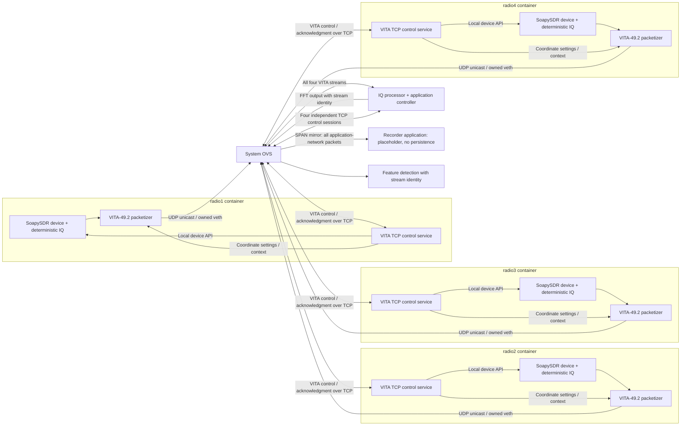

# Four-radio SoapySDR / VITA-49.2 implementation brief

## Purpose and status

Implement a hardware-free demonstration with **four independent radio containers**,
each running its own SoapySDR device instance, deterministic IQ source and VITA-49.2
packetizer. Deliver each radio's UDP unicast stream through system Open vSwitch
(OVS) to the IQ processor. Use OVS port mirroring to copy all packets on the
demonstration's owned application network to a separate recorder application. In
this demo, that application is a placeholder and does not save packets. The IQ
processor computes FFT output and sends it to a feature-detection stage, with
configurable frequency-bin width. The IQ processor also acts as the
application controller, issuing commands to each radio over a separate TCP control
channel carrying VITA-49.2 control and acknowledgment packets. All inter-node application connections traverse OVS, including radio
control, unicast IQ delivery and downstream feature-processing traffic.

This system models a future real configuration, with distinct radio, IQ processor,
feature-detection and recorder applications. The recorder placeholder preserves that
application boundary while deferring persistence. This is a specification for new
work, not documentation of an available example.
The workspace has reusable SDR, networking, capture and console components, but
it does not yet provide this four-radio SoapySDR/VITA system. Updating this document
does not authorize implementation, infrastructure provisioning or privileged tests.

See the [phased implementation plan](../design/four-radio-vita/implementation-plan.md)
for sequencing, deliverables and exit criteria. P1 develops and tests the radio as
a standalone entity before integrating the complete system.

## Current workspace baseline

Read [AGENTS.md](../AGENTS.md), [project decisions](project-decisions.md),
[architecture](GraphX_Architecture.md), [user guide](user-guide.md),
[test procedure](test-procedure.md) and the [example matrix](../examples/README.md).
The previously suggested `prompt/implement.md` and `prompt/verifier.md` do not exist;
use these maintained sources instead.

| Existing component | Reuse and limits |
|---|---|
| [Simulated SDR graph](../examples/sdr-node/simulated/graphx.yml) | Container radio, processor and result sink; resolved bindings, staged credentials and telemetry. Uses portable networking, not the required OVS data plane. |
| [SDR protocol](../examples/sdr-node/common/protocol.py) | Bounded custom `SDR1` IQ messages, signed integer IQ samples and telemetry helpers. This is not VITA-49.2. |
| [SDR processor](../examples/sdr-node/common/processor.py) and [type](../config/catalog/types/sdr.processor.json) | Existing power calculation and control integration. The type permits one sample input connection and one radio-control connection; four-stream VITA reception requires an explicit extension or new type. |
| [SDR sink](../examples/sdr-node/common/sink.py) | Result-consumer pattern, not an existing feature-detection or raw VITA recording subsystem. |
| [OVS sample pipeline](../examples/sample-pipeline/ovs/graphx.yml) | Authored switches, networks, identity-owned container veth attachments and edge paths. Reuse this ownership model. |
| [Network observation graph](../design/graph-generation/scenarios/network-observation/graphx.yml) | Reuse OVS ownership and mirror patterns. GraphX SPAN/PCAPNG is an optional diagnostic capture facility, not the recorder application. |
| [Release builders](../scripts/release/) | Verified native installations, shared OCI images, pinned catalogs and license/SBOM evidence. No example-specific build or launch framework. |
| Web console | Application and network topology, history, capture and a persistent bottom node-console panel. Logs exist for managed native, container, namespace and QEMU nodes. Interactive serial is QEMU-only. |

## Required architecture



Use one reusable radio implementation instantiated as `radio1` through `radio4`.
Each container owns its own SoapySDR instance and signal-generation state. Do not
replace them with one process that emits four logical streams. Each radio sends
its VITA datagrams once, addressed to the IQ processor. The recorder receives
mirrored Ethernet frames rather than packets addressed to a UDP application socket.
Multicast groups, joins and multicast replication are not required for this design.

OVS forwards ordinary UDP data and TCP command/reply traffic to their destinations
and independently mirrors the application-network packets to the recorder. The
recorder also receives mirrored downstream feature-processing traffic and other Ethernet
traffic within the declared scope. Control and data may share a node's owned OVS
attachment. The mirror output is a dedicated passive capture destination, not an
alternate application forwarding path.

The radio boundary is IQ generation/acquisition through Ethernet/IP/VITA output.
Consumers identify streams through validated protocol and network information,
never arrival order. Keep VITA parsing and adaptation separate from generic GraphX
processing. Do not put a GraphX envelope or length prefix around on-wire VITA UDP
packets. Define the downstream FFT representation explicitly; use existing
GraphX envelope wire format 2 where the selected downstream port contract requires it.

## Configuration and lifecycle contracts

- Author `examples/four-radio-vita/graphx.yml` using configuration **version 3**.
  The C++ loader remains authoritative; normalized JSON remains contract version 2.
- Put reusable C++ behavior under `include/graphx/` and `src/`, with thin executable
  entry points under `apps/`. Reuse existing language-specific runtime helpers
  where appropriate rather than forcing a duplicate implementation.
- Add or extend catalog types, parameter validation, schemas, normalized bindings,
  compiler outputs and tests together. Do not invent YAML fields that the loader
  does not accept or add a second manifest consumed only by the radio launcher.
- Configure identifiers, unicast destinations, ports, interface bindings, center
  frequency, sample rate, bandwidth, gain, waveform and deterministic seed per radio.
  Define which identifiers map to actual VITA fields and which are local configuration.
- Use system OVS and identity-owned `container_veth` attachments. Docker Compose
  manages processes and management connectivity, not this graph's data-plane network.
  Do not use Docker MACVLAN/IPVLAN drivers or hand-written Compose overlays.
- Run the OVS demonstration on native Linux or the dedicated GraphX Lima guest.
  On macOS, OrbStack remains the portable container engine; it does not host managed
  OVS networking. Keep privileged sockets and high-I/O artifacts inside Linux.
- Use the common ownership ledger, locks, startup barrier and fail-closed cleanup.
  Keep all application nodes in this demo container-based; mixed native/container
  applications in one graph are rejected.
- Extend the existing verified image/catalog pipeline. Decide whether dependencies
  fit the existing shared SDR image or justify a new reusable image role. Do not
  introduce topology-specific images, unchecked tags or placeholder release digests.
- Run continuously until explicitly stopped. Bound queues, buffers, datagrams,
  processing work and logs; bound recorder receive/discard buffers and define overload
  and shutdown behavior. Persistent recording storage is outside the initial demo scope.

## SoapySDR and VITA dependency decision

The radio-local control service is the selected control architecture. Use SoapySDR's
local device API behind it; remote-device middleware is not required for this demo.

The selected backend is a workspace-owned virtual device derived from
`SoapySDR::Device`. Each radio container creates its own instance of this reusable
implementation. The commanded frequency represents the radio's RF center frequency,
not the frequency of the sampled IQ sine wave. The device generates deterministic
baseband sine-wave IQ at the commanded sample rate; acquisition obtains samples through the device's streaming
interface. The radio-local control service applies settings to this same instance,
and the VITA packetizer consumes its samples. Do not generate the waveform in a
parallel path that bypasses the device.

Define supported frequency/sample-rate ranges in the implementation design and
reject unsupported settings explicitly. Sample generation and simulated timestamps
must use the same sample index and applied sample rate. Keep stream reads bounded
and preserve the requirement that no demonstration IQ is emitted before successful
initial configuration. Verify applied center frequency in device status and VITA
context, and verify sample rate and baseband tone behavior against generated samples,
including independence of the four device instances.

### Virtual-device signal model

Each radio observes one simulated signal at an authored absolute RF frequency that
remains fixed during the run. The commanded center frequency tunes the receiver;
the generated IQ tone offset is `signal_frequency - center_frequency`. Changing
the center therefore changes the baseband offset, not the simulated signal's
absolute frequency. Do not use the RF center frequency as the sampled tone frequency.

| Setting | Selected behavior |
|---|---|
| Center frequency | Commanded receiver tuning, reported in device status and VITA context. |
| Signal frequency | Authored per radio, fixed during the run. |
| Sample rate | Commanded rate governs IQ generation, timestamps and pacing. |
| Bandwidth | Ideal passband extending from negative to positive half-bandwidth around center; require positive bandwidth no greater than sample rate. An out-of-band tone produces zero-valued IQ while streaming continues, rather than an aliased tone. |
| Gain | Scale amplitude by `10^(gain_dB/20)`; saturate at signed 16-bit limits and report clipping. |
| Amplitude | Authored pre-gain peak level, default 0.25 full scale. |
| Phase | Deterministic initial phase, continuous across packets and bursts. Preserve phase across setting changes and apply the new phase increment at the change boundary. |
| Noise | Disabled initially; seeded noise is a future extension. |

For an in-band signal, generate complex IQ as follows, then quantize to signed
16-bit components using a documented conversion rule:

```text
A = amplitude * 10^(gain_dB / 20)
I[n] = A * cos(phase[n])
Q[n] = A * sin(phase[n])
phase increment = 2*pi * (signal_frequency - center_frequency) / sample_rate
```

Use these initial demo defaults for all radios: **1 MSample/s**, **800 kHz
bandwidth**, **0 dB gain**, and **0.25 full-scale peak amplitude**. Initial tone
offsets are **+50 kHz**, **+100 kHz**, **-150 kHz** and **+200 kHz** for radios 1–4,
respectively. Author each absolute signal frequency as its initial center frequency
plus that offset; subsequent tuning does not move the absolute signal frequency.

At this sample rate, a maximum-size burst spans **262.144 ms** of samples. Four
radios generate **16 MB/s of IQ payload** (decimal bytes), excluding packet overhead,
mirror copies and FFT traffic. This is the nominal source load, not a measured
throughput or lossless-capture guarantee.

No analog filter response, AGC or hardware settling simulation is required. An
out-of-band zero-valued sample is a valid generated sample, not padding for a partial
packet or replacement for lost data. Keep that distinction in sample/gap accounting.

### Dependency selection

Inspect the existing implementation and current primary sources when integrating
SoapySDR and VITA packet support. An external synthetic-device
plugin is not required: implement the selected virtual device in the workspace.
Use `vrt_framework` as the sole VITA 49.2 encoding, decoding and protocol
implementation. Select its explicitly configured `graphx_radio` profile and pin a
verified implementation commit. GraphX owns the SoapySDR device adapter, mutual TLS,
socket lifecycle and graph orchestration. Do not retain generated packet classes,
`vrtgen`, or a second GraphX command parser after the integration migration.
The standalone P1 application now consumes `vita::core` at `dbe85d37155145842da60367af1c4beef8801b0c` and explicitly
selects `graphx_radio`. Its Soapy, controller and host-owned mTLS bindings and
independent application gates are recorded in
[P1 verification](../design/four-radio-vita/p1-verification.md); the final graph
and published release remain later phases.
Dependency selection alone does not establish interoperability or P1 acceptance.

Record each dependency's exact upstream source/version, purpose, license, maintenance
status, supported VITA subset, transmit/receive direction, ARM64 Linux compatibility,
reproducible build inputs and reason existing GraphX code cannot provide the function.
Exercise the selected virtual device through SoapySDR; a waveform generator merely
placed beside an unused SoapySDR installation is insufficient.
Update dependency locks, release verification, SBOMs and
[license inventory](release-license-inventory.md) for selected dependencies.

The selected mappings and acceptance evidence are specified in
[command analysis](../design/four-radio-vita/command-analysis.md).

### VITA packet and timing requirements

Assign the VITA stream ID from the source radio index: `radio1` uses `1`, `radio2`
uses `2`, `radio3` uses `3`, and `radio4` uses `4`. Preserve that mapping through
context association, processor validation and downstream results. Data has a present eight-byte Class ID `00 FF FF FF 00 00 00 00`: unknown
OUI and unspecified Information/Packet Class. Context and Command omit Class ID.
The selected profile validates presence and identity without using the class codes
as an application dispatch registry.
The IQ data-packet trailer is present and must be included in packet-size accounting.

A full data packet contains **1,024 complex IQ samples**, each comprising one
16-bit I component and one 16-bit Q component: 4,096 bytes of sample payload before
headers. Every VITA data packet must convey its actual number of valid IQ pairs.
A final partial packet carries only the remaining valid samples; the radio does
not zero-fill it to 1,024 pairs. Components are signed 16-bit integers. Specify component ordering, byte order
and scaling in the final wire profile.

Burst framing uses start, interior and end semantics, with **up to 1 MiB of valid IQ
sample payload per burst**. This means 1,048,576 bytes, excluding VITA, UDP, IP,
Ethernet and context-packet overhead. It permits 262,144 IQ pairs: a maximum-size
burst contains exactly 256 full packets. Smaller bursts may end with a partial
packet. A burst spans multiple UDP datagrams; it is not a single 1 MiB network
packet. Burst support is required; whether the initial
demo also exposes standalone mode remains an implementation-scope decision.

After the scheduled start, each radio continuously streams back-to-back bursts
until explicitly stopped. Burst boundaries frame the continuous sample stream;
they do not introduce intentional idle periods or reset sample time or waveform
phase. Each burst remains bounded by the 1 MiB valid-IQ payload limit.

Calculate the actual sample count from the VITA Packet Size field, whose unit is
32-bit words. For this profile, one 16-bit I plus one 16-bit Q occupies one word:

```text
IQ sample count = packet_size_words - header_words - trailer_words
```

Here `header_words` includes the base header and all present non-payload fields
before the samples, including stream ID, class ID and timestamps. Determine their
presence from the selected packet type and flags; do not assume one fixed header
length. This demo's IQ packets include a trailer, so subtract its encoded length;
zero trailer length applies only to other supported layouts without a trailer.
Ethernet, IP and UDP
headers are outside the VITA packet and are not part of this calculation. No
additional sample-count field or proprietary header extension is required.

Validate the declared VITA size against the received UDP payload before subtracting
lengths. Reject truncated packets, inconsistent field layouts, length underflow and
sample counts above 1,024. The sample-count rule applies to this IQ data profile,
not context or control packets. Reject empty data packets unless the final profile
explicitly permits them. Verify full and partial packets with optional header fields
and the required trailer using an independent decoder. If the codec also supports
trailer-free layouts, test those separately without treating them as this demo's
transmit profile.

Map burst markers to a documented, standards-compatible VITA representation. Define
single-packet burst markers, burst identity/sample position, loss of start/end packets
and an incomplete-burst timeout. Keep reassembly and in-flight burst counts bounded.

The IQ processor must preserve actual sample counts, burst boundaries, timestamps
and detected gaps as metadata associated with its FFT output. The IQ processor owns
zero padding for missing samples when forming FFT input blocks. A short VITA packet
or a burst boundary alone does not indicate missing samples: continue the FFT window
with samples from consecutive packets/bursts. Metadata must distinguish received samples from
inserted zeros so feature detection can assess each spectrum. Mirrored packets remain unmodified;
the recorder placeholder does not insert samples or persist packets. Optional GraphX
diagnostic captures preserve the original packet bytes. Sample count alone does not
locate lost data, so the selected timestamp/position rules must support gap detection.

**This demo uses deterministic simulated time**, expressed in picosecond units.
No GPS hardware or actual clock discipline is required or claimed. GPS-disciplined
operation is a future integration concern, not a prerequisite for this demo.
Specify the simulated epoch/time scale, VITA integer/fractional timestamp encoding,
timestamp reference sample and restart behavior. Derive sample time from the
configured simulation epoch and sample index rather than packet-arrival time or
container scheduling. Use the common scheduled start as the first-sample time for
the four radios. Across successive bursts, advance timestamps using the cumulative
sample index and applied sample rate, without an intentional inter-burst time gap.

Use integer time/sample arithmetic; sample rates need not divide one trillion
picoseconds evenly, so avoid cumulative drift from rounding every sample interval.
Define timestamp continuity when sample rate changes and explicitly label any
simulated lock/holdover scenarios. Picosecond representation does not imply
picosecond physical accuracy. Pace the continuous stream according to the applied
sample rate, allowing bounded packet batching and host scheduling jitter. Bursts
are not emitted as fast as the CPU permits independently of that rate. Host-time
pacing must not change deterministic sample timestamps. Define bounded handling
and reporting of missed pacing deadlines; do not accumulate an unbounded catch-up
queue or silently reset the sample timeline.

Finish the profile with packet types, the selected stream-ID mapping and zero/unused
class ID, exact field-presence encoding, context fields,
count/wrap behavior, context cadence and parameter-change rules. Cite authoritative
specifications available to the implementer. Verify that the selected SoapySDR
source and VITA library preserve the required timing semantics and precision; do
not fabricate precision by merely changing timestamp units. Do not claim standards
compliance from self-generated packets passing only the matching decoder. Use
independent decoding or authoritative vectors and document unsupported features.

### Jumbo-frame contract

Carry each VITA data packet in one UDP datagram without IP fragmentation. The
4,096-byte IQ payload already exceeds a conventional 1,500-byte IP MTU. Derive the
required IP MTU from the complete VITA packet plus UDP/IP headers, and account for
Ethernet/VLAN overhead separately when sizing capture frames. An IP MTU of 9,000
is a proposed configuration target, subject to support across the owned path.

Configure and verify MTU end to end: radio and processor interfaces, both ends of
owned veth pairs, relevant OVS ports and the mirror/capture path. Apply the same
requirement to downstream links according to the chosen FFT message size and transport. Audit the authoritative
MTU model, socket receive limits, parser limits, capture snap length and release
fixtures; do not assume existing small-packet examples support these datagrams.
Extend configuration and lifecycle contracts where needed rather than issuing
out-of-band interface commands. Insufficient MTU must produce a clear prerequisite
failure. Acceptance must demonstrate intact datagrams, no IP fragmentation and
complete mirrored packet bytes at the chosen operating load.

## Unicast delivery, port mirroring and recording

Each radio has a dedicated UDP data port and a dedicated TCP control port. Use
four distinct UDP data-port numbers and four distinct TCP control-port numbers;
do not multiplex all radios onto one processor UDP listener. The endpoint roles are:

| Radio | UDP data connection | TCP control connection |
|---|---|---|
| `radio1` | Radio 1 sends to the IQ processor's dedicated `data1` port | Controller connects to Radio 1's `control1` listener |
| `radio2` | Radio 2 sends to the IQ processor's dedicated `data2` port | Controller connects to Radio 2's `control2` listener |
| `radio3` | Radio 3 sends to the IQ processor's dedicated `data3` port | Controller connects to Radio 3's `control3` listener |
| `radio4` | Radio 4 sends to the IQ processor's dedicated `data4` port | Controller connects to Radio 4's `control4` listener |

`data1`–`data4` and `control1`–`control4` are labels, not final numeric assignments.
Declare numeric ports, radio UDP source bindings and processor destination bindings
explicitly in the authored configuration. UDP source and destination ports must not
be confused with TCP client ephemeral ports: the radio listens for TCP control,
while the IQ processor listens for UDP data. All these connections traverse OVS.
Validate the expected radio source address and VITA stream identity for each UDP
listener; a destination port alone is insufficient to establish stream identity.

Propose a collision-checked subnet, per-node addresses and interface bindings. Define
the processor's four-stream input bindings explicitly; current port cardinalities
must not be assumed to cover them. Configure the mirror through the authoritative graph/capture model
and owned lifecycle. Extend those contracts where necessary; do not add a hidden
`ovs-vsctl` setup script or a parallel capture manifest.

“All packets” means all Ethernet packet traffic on this demonstration's owned OVS
application network, in both directions: all four radios' VITA data/context packets,
TCP control sessions and replies, downstream processing traffic, and ARP or other
network traffic. Do not limit mirror selection to VITA, UDP or selected transport ports.
Do not capture unrelated bridges, host interfaces or other graphs. Platform/browser
traffic on GraphX's separate management network lies outside this mirror's scope.

Specify the complete source-port/direction selection, dedicated mirror destination
and maximum frame size so the recorder application can receive supported packets
intact. Document and test duplicate behavior when a packet matches more than one
selected port/direction. Provision the mirror endpoint and recorder receive path
before releasing application startup. Recorder capture is best effort, including
during system shutdown: there is no requirement to receive every final packet,
drain all queued packets or stop the recorder after every producer. Use bounded
shutdown through the common owned lifecycle. Recorder failure must not interrupt
normal application forwarding.

The IQ processor must validate packet lengths and types, identify all four streams,
interpret context, decode IQ, compute FFTs and emit identified FFT output. Specify
loss, duplicate, reordering, missing-context and restart handling. Start with simple,
distinguishable deterministic tones and display their detected center frequency for
each received FFT packet. Preserve radio/stream identity through every processing stage.

### FFT processing and feature-detection boundary

Feature detection receives FFT output from the IQ processor through OVS. Configure
the requested frequency-bin width in hertz in the authored graph and carry it through
the authoritative loader, catalog parameters and resolved runtime configuration.
For an FFT of length `N` at applied sample rate `Fs`, frequency-bin spacing is
`Fs / N`. Supported FFT lengths and the maximum complete message size constrain
the configurable bin width. Reject a requested width that cannot be represented by
a supported FFT length within the packet budget; do not silently round it or split
one result across packets. Do not confuse bin spacing with the resolving power of
a windowed or zero-padded signal.

FFT output contains **power values**, not complex coefficients or magnitude values.
Make the windowing function and overlap configurable through the authored graph,
loader and resolved configuration. Define supported windows, overlap units/range,
power normalization, bin ordering and numeric representation in the wire contract.
Each complete FFT result, including its metadata and any required GraphX envelope,
must fit in **one UDP datagram carried by one jumbo IP packet**, without IP
fragmentation or application-level splitting. Derive the maximum FFT length from
the actual serialized power-bin size, number of transmitted bins and all message
overhead, leaving room for UDP/IP headers within the configured path MTU. Do not
budget using the power array alone. Validate this constraint before startup and
when accepting any supported sample-rate or FFT-setting change.

Each output must identify its source stream, applied RF center frequency, sample
rate, FFT length, actual bin width, frequency-axis convention, window/overlap and
normalization, sample-time interval and valid-sample/gap metadata. FFT windows span
consecutive bursts; a burst boundary does not flush or reset the FFT input buffer.
Pad missing samples with numeric zeros (not null/NaN power values), preserving their
positions on the sample timeline and marking the affected FFT result. Use bounded
gap metadata that fits the same packet budget. Keep buffering and gap processing
bounded; a prolonged stream outage must not create unlimited zero-filled work or
prevent processing healthy streams. The feature detector consumes these spectra; automatic
feedback-driven retuning remains deferred as specified below.

### Feature-detection output

For this demo, feature detection displays the detected signal center frequency for
each received FFT packet, identified by radio/stream and FFT sample-time interval.
Derive the detected frequency from the power spectrum and its frequency-axis
metadata; do not simply display the commanded receiver center frequency. Express
the result as an absolute RF frequency by combining the detected baseband offset
with the applied receiver center frequency. Specify the peak-estimation rule and
its accuracy relative to bin width in the implementation design.

Use existing observation/display facilities with bounded buffering and retention.
Each received FFT produces a detection result or an explicit no-detection/invalid
result; all-zero or unusable spectra must not fabricate a detected frequency.
Preserve gap/quality information. Display updates do not authorize tuning commands;
automatic feedback, classification and other feature processing are outside this
initial scope.

### Recorder application boundary

Implement `recorder` as a separate application in its own managed container, with
an authored catalog type, resolved bindings, readiness, telemetry, logs and the
common owned lifecycle. It receives frames from a dedicated OVS mirror destination,
not from the radios' UDP sockets and not by subscribing to the IQ processor's output.
Represent it as an application node with an explicit mirror relationship in the
network topology. Do not substitute the GraphX capture helper for this application.

For the initial demo, implement a bounded receive-and-discard placeholder: expose
receive packet/byte and drop/error counters and make its non-persistent status
visible. It does not write packet files, maintain a recording archive or claim
successful storage. Avoid per-packet log output that could become an accidental
unbounded recording mechanism. The future storage format, indexes, quotas, rotation,
replay and sustained recording performance remain deferred decisions.

Define the recorder's owned mirror-facing attachment and raw Ethernet receive
mechanism through the authoritative configuration/compiler and common lifecycle.
Identify any required capture capability and constrain it to this endpoint; do not
give the application Docker/OVS sockets or unrestricted host-network access. Extend
existing mirror-destination/binding contracts if a container endpoint is not already
supported. A future persistent recorder must be able to replace the placeholder
without changing the radio or IQ processor network contracts.

“All packets” defines the mirror selection scope, not a lossless capture guarantee.
Reception is best effort; packets may be lost during operation or shutdown. Set an
acceptance traffic rate, verify recorder reception and available drop counters at
that rate, and report overload without claiming unobservable losses are counted.
Shutdown need not preserve or save all packets and must not wait for complete
capture. No recorder-last ordering or lossless drain is required.
Packet persistence is deliberately not an acceptance requirement for the placeholder.

### Optional GraphX diagnostic capture

GraphX infrastructure may independently capture messages/packets when diagnostics
or acceptance needs saved evidence. Reuse its owned SPAN/PCAPNG facilities and
Capture view, with explicit capture configuration, bounded retention and drop/error
reporting. Keep the diagnostic capture endpoint/handoff separate from the recorder
application's receive path; do not silently redirect its mirror destination or
replace its counters with infrastructure capture counters. Design any additional
mirror delivery needed through the same owned OVS model.

Document how to enable, retrieve and inspect diagnostic captures. Such files are
GraphX verification/observation artifacts, not output saved by the recorder
placeholder. When diagnostics are disabled, no packet files should be implied.
Full-frame snapshot length and byte comparisons can be verified through separately
enabled infrastructure capture without claiming recorder persistence.

Mutually authenticated TLS control remains encrypted in diagnostic captures. Do
not export private keys or weaken encryption to make commands readable. Use
authorized application audit/status records for command semantics. The GraphX
envelope dissector must not be described as a VITA decoder. Do not add unrestricted
privileged capture commands to the web API.

## Observation and control

### Radio-local control service

Include a small TCP control service inside each of the four radio containers.
Implement it as a component of the reusable radio application, sharing that
application's single SoapySDR device instance with the IQ acquisition and VITA
packetization components. Each container still owns an independent device instance.
No separate control container, second device owner or SoapyRemote server is required.

The service accepts authenticated requests from the IQ processor/application
controller on the radio's declared OVS-facing TCP endpoint. Reuse the existing SDR
mutual-TLS credential and bounded-connection patterns, but replace the existing SDR
JSON command encoding with binary VITA-49.2 control/acknowledgment packets. Bind only to the resolved
control interface/port, validate the controller identity and supported operation,
and dispatch local SoapySDR API calls through the radio's device owner. This service
is a bounded radio-command interface, not a remote shell or arbitrary API executor.

Provide status/capability queries, start/stop streaming and setters for supported
frequency, sample rate, bandwidth and gain. Query the selected device's supported
ranges and reject unsupported values explicitly. Report requested versus applied
settings and errors without claiming a change succeeded before the device applied
it. Coordinate settings that require stream reconfiguration with acquisition and
VITA context emission; keep control reachable while streaming is stopped.

Use bounded control request and response sizes, a bounded command queue, connection
limits and deadlines. Define these limits in the implementation design and test
them. Serialize device mutations with acquisition/stream lifecycle operations rather
than assuming concurrent driver calls are safe. Use bounded acquisition waits so
IQ reads cannot indefinitely block control handling. Correlate replies to requests,
scope duplicate-command handling to the radio runtime, and make retry behavior
explicit so reconnect does not accidentally reapply state changes.

Start the control listener as part of radio readiness and stop it through the same
owned application lifecycle. Report control availability separately from streaming
state. Expose bounded service logs and command outcomes through existing observation
and audit mechanisms without logging credentials or private key material.

### VITA control/response wire contract

Use **VITA-49.2 control packets and acknowledgment packets** for radio commands and
responses. This applies to initial configuration and any subsequent supported
control operation. The IQ processor encodes the packets, and each radio-local
service decodes and validates them before dispatching local SoapySDR operations.
Use the same selected VITA implementation for compatible data, context and control
support where practical; dependency evaluation must explicitly check control and
acknowledgment coverage, not only IQ packet generation.

Carry these binary packets over the per-radio TCP connections through OVS, retaining
mutual TLS for authentication and confidentiality. VITA is the application message
format; it does not replace TCP or TLS. Do not wrap radio commands in the existing
SDR JSON protocol or GraphX data envelopes. Platform configuration and telemetry
retain their existing formats.

Frame consecutive VITA packets using the VITA Packet Size field in 32-bit words.
The stream reader must handle fragmented TCP reads and multiple packets in one read,
validate packet type and bounded declared size before allocation, and reject
truncation, impossible layouts and stalled partial packets. Do not assume a TCP
read corresponds to one VITA packet or add an undocumented outer length prefix.
Control-packet size limits are separate from IQ data-packet and burst limits.

Define the supported control profile before implementation: controller/controllee
identifiers, message correlation, Control/Acknowledge Mode (CAM) settings, field
presence indicators and the standard parameter fields for sample rate, tuned
frequency, bandwidth, gain and other supported operations. Map initial settings,
status/capability queries and start/stop behavior explicitly. Verify field names,
units and encodings against the selected specification and independent test vectors;
do not invent profile fields to fill gaps in a library.

Use AckV for validation and scheduling acceptance, AckX only after the device
action completes, and AckS for observed state. AckV cannot confirm execution.
AckX carries the actual effective timestamp; AckS carries observation time.
EXECUTE requests for post-action state use ReqX+ReqS and receive AckX then AckS.
ReqS alone is valid for read-only NO_ACTION queries, not EXECUTE.

Correlate replies with the correct radio and operation; define timeout, negative
acknowledgment, unsupported-field and partial-application behavior. Preserve bounded
idempotent retry handling independently of the TCP connection lifetime.

The recorder placeholder receives mirrored TCP/TLS frames but does not save them.
Separately enabled GraphX diagnostic capture can record those packets. VITA control messages are
inside the encrypted TLS stream, so readable wire-format verification must use
codec vectors or an authorized test endpoint, not a promise that passive PCAP
inspection can decode encrypted commands.

### Independent radio control channel

The IQ processor has two roles within the same application: receiving/processing
the four IQ streams and controlling the four radios. Each radio exposes a separate
control endpoint; the processor initiates commands and receives that radio's
acknowledgments, status and errors. The recorder is a passive packet-capture consumer and has no
radio-control authority.

Use the existing mutually authenticated TCP SDR control pattern as the starting
point. Declare four independently bound processor-to-radio control connections,
with distinct per-radio TCP listener ports, endpoints and credentials, separately from the VITA UDP
connections. Extend the current processor type's one-control-connection limit
explicitly. Resolve all endpoints through authored configuration and compiled node
bindings; do not hard-code radio addresses or infer a control endpoint from an IQ
packet's source address.

Route all four TCP control connections over the owned OVS network, alongside the
UDP unicast data connections. Separate channels mean distinct transports, sockets,
ports, bindings and application handling; a separate network or VLAN is not required.
Declare control attachments and edge paths explicitly in the authored graph and
resolve them through the existing compiler and ownership model. Do not carry radio
control over a Docker management bridge or a direct link that bypasses OVS. Platform
telemetry and browser access retain the existing GraphX management lifecycle; they
are not a substitute path for these application connections. Do not expose the
radio endpoints directly to the browser.

Define commands for status, start/stop streaming and the supported radio settings
(such as frequency, sample rate, bandwidth and gain). Specify per-radio command
identity, validation, acknowledgment versus application, timeouts, bounded retries
and duplicate handling. A command for one radio must not change another radio's
state. Relate applied setting changes to the appropriate VITA context and sample
boundary so the IQ processor and, when diagnostic capture is enabled, offline
packet analysis can interpret the resulting stream correctly.

Control servicing must remain responsive when IQ streaming is stopped, a data
consumer is slow, or UDP IQ delivery alone is disrupted. Keep control queues
and execution independent of blocking IQ reception/processing. Define behavior
after controller disconnect/restart without assuming independent channels eliminate
their shared application's failure domain. Both channels also share OVS: losing
the switch or a shared attachment can interrupt both TCP and UDP. Test reconnect and per-radio state
reconciliation rather than blindly replaying old commands.

### Initial configuration and future retuning

For this demo, the IQ processor sends **one initial VITA configuration command to each
radio per run**, specifying sample rate, tuned frequency and other required authored
parameters, such as bandwidth and gain. Keep these values in graph configuration,
not application source. Each command carries the complete intended initial settings
for its target radio and receives a correlated applied-settings acknowledgment or
an explicit failure response.

Radio readiness means the control service is reachable and the device is available;
it must not depend on receiving this configuration command. After the common graph
startup barrier is released and IQ receive endpoints are ready, the processor issues
the four commands through the radios' TCP control endpoints over OVS. A radio must
not emit demonstration IQ using unconfigured defaults. Configuration does not start
streaming. After a bounded configuration window, the controller sends a separate
VITA start command to each successfully configured radio with a common scheduled
start time. Each radio begins its data stream only after successful configuration
and the scheduled start, with VITA context matching the applied settings. A failed
initial configuration must be visible and must not be reported as a successfully
initialized radio.

The scheduled time establishes a common first-sample time in the simulated timeline.
Map the timed-start request to the supported VITA control fields using the selected
reference; do not assume a packet creation timestamp alone requests timed execution.
Define how simulated time maps to a shared host execution deadline so radios can
begin transmission approximately together, allowing command delivery and arming
lead time. Packet emission and arrival can vary with scheduling and networking;
the requirement is aligned simulated sample timestamps and approximate coordinated
startup, not simultaneous packet arrival or picosecond physical synchronization.
Specify a measurable startup tolerance, late-command behavior, start acknowledgment
semantics. A radio that cannot arm before the scheduled time is reported unavailable
and must not prevent the ready radios from starting. Define how a recovered radio
joins the continuing timeline without restarting healthy streams. Keep
retries idempotent so a repeated start does not reset an active stream's sample time.

“One initial command” describes one logical configuration operation per radio,
followed by the separate scheduled-start operation,
not a guarantee of exactly one network transmission under failure. Bounded retries
must reuse the operation identity and must not apply the configuration twice.
Do not periodically resend initial settings or overwrite runtime settings on an
ordinary TCP reconnect. Controller/radio restart behavior must reconcile runtime
identity and applied state before deciding whether a new initialization is needed.
The normal demo performs initialization once and then runs without automatic retuning.

Preserve the ability for feature detection to request a tuning change during
operation. Such requests go **feature detection → OVS → IQ processor/controller →
OVS → selected radio's existing TCP control service**. The IQ processor remains the
single application controller: feature detection does not directly command a radio.
Treat this feedback path as a future extension, not a required automatic tuning loop
for the initial demo. Any implemented feedback connection must be authored, validated
and routed through OVS under the common lifecycle.

Before enabling feedback-driven retuning, define the request/result schema, target
radio identity, authorization, command arbitration, rate limits and effective sample
or burst boundary. Reuse the same device owner and control dispatch as initialization;
acknowledge actual applied settings and emit corresponding VITA context. Define how
in-flight IQ and feature results are associated with the old or new tuning state.
Do not add a second device-control mechanism or silently assume cross-radio atomicity.

### Partial failure and degraded operation

The system must continue operating with reduced capability when application
components fail. Do not tear down healthy components or require all four radios to
remain available. Apply this policy during initial startup as well as steady-state
operation: use bounded readiness/configuration deadlines and start the available
subset. Extend the common authored readiness and lifecycle contracts where needed;
do not bypass ownership checks or introduce a separate launcher.

- A failed, disconnected or unconfigured radio removes that stream from available
  coverage. Continue FFT processing and feature detection for healthy streams; do
  not block them waiting for missing input or represent missing data as valid IQ.
- Recorder failure removes best-effort capture without stopping acquisition,
  processing or forwarding. Feature-detector failure must not block radio control
  or acquisition; bound queued FFT output and report discarded results.
- If the IQ processor/controller fails, already-started radios continue their
  configured streaming. FFT output and feature detection become unavailable until
  processing recovers. Reconnection must reconcile radio state without blindly
  reconfiguring or restarting healthy streams.
- A shared OVS failure can interrupt every application data/control path. Keep
  surviving processes responsive with bounded resources and report the unavailable
  functions; continued operation does not imply useful throughput through a failed
  shared dependency or require redundant controllers/switches in this demo.

Expose degraded status, affected nodes/streams, missing results and available loss
counters through telemetry and logs. **Failed containers do not restart automatically
in this demo.** Do not configure a container restart policy or application supervisor
that respawns failed containers. Healthy components continue in a degraded state;
restoring failed containers requires explicit operator action through the supported
owned lifecycle. Bounded connection retry/backoff for surviving processes is
distinct from restarting a failed container. Recovered
streams must carry unambiguous timing/context and discontinuity information.
Availability does not override malformed-configuration rejection, authentication,
release verification or identity-checked infrastructure mutation and cleanup.

### Platform observation and operator access

Expose readiness, per-radio packet/sample counters, processor and recorder receive
counts, sequence gaps, receive/queue drops and feature results through existing
telemetry contracts. Show authored application edges and actual OVS network paths.
Use the bottom Node console for per-node logs, with the existing bounded retention
and unavailable states. Container shell access is not part of this demonstration.

Use staged credentials, observation authentication and the CLI's authenticated browser
handoff. Do not embed tokens, private keys or device credentials in configuration or
examples. Serial grants apply only to QEMU; pause/resume/reset grants do not implicitly
authorize tuning a radio. Define and test any new radio controls through existing
credential, authorization, runtime-identity and audit contracts.

## Intended user workflow

Use the existing `graphx example` CLI. These commands describe the **future example**
and are not runnable until its graph, types and artifacts are implemented:

```sh
graphx example plan four-radio-vita
graphx example up four-radio-vita --allow-privileged
graphx example status four-radio-vita --allow-privileged
graphx example open four-radio-vita --allow-privileged
graphx example logs four-radio-vita --node radio1 --allow-privileged
graphx example down four-radio-vita --allow-privileged
```

Document only implemented control grants and scenario action IDs. Reuse
`graphx example scenario` for a declared verification action if its requirements
fit the supported scenario model; otherwise extend that model with tests first.

Explain `--restart`, named `--instance` runs and conflicting ports. A saved explicit
`--images` or `--release` selection persists across restart; select newly built
verified artifacts explicitly when an old release lacks new runtime features.
Do not instruct users to erase ownership records or broadly prune Docker resources.

## Verification and completion

Begin with a short design/inspection report under `design/four-radio-vita/` covering
reused and new files, dependency/license decisions, the exact VITA profile, parameter
and mirror contracts, addressing, bounds, ownership, capture and verification.
Report genuinely new blocking conflicts before affected implementation; continue
independent work. Do not silently relax four independent SoapySDR devices, valid
VITA packets or the separate mirror-fed recorder application to fit existing examples.

Use nearest existing tests, including [SDR tests](../tests/test_sdr_example.py),
[OVS compiler tests](../tests/test_ovs_compiled.py) and
[OVS live acceptance](../tests/test_ovs_execution_live.py). Verification must cover:

| Area | Required evidence |
|---|---|
| Configuration | Four independent instances from one implementation, four dedicated UDP data ports and four distinct radio TCP control listener ports; malformed parameters, duplicate/conflicting identities, bindings and unsupported targets rejected. |
| Protocol | Independent vectors/decoder; lengths, count wrap, timestamps, context, IQ format, malformed/truncated/oversized packets and missing context. |
| Timing | Deterministic simulated picosecond timestamps, per-radio alignment, inter-burst progression, rate changes and restart behavior without cumulative rounding drift. No actual GPS-discipline claim. |
| Burst/count handling | Maximum 1 MiB payload, full and partial packets, sample counts derived from packet size with the selected header fields and required trailer, malformed-length rejection, single-packet bursts, missing boundaries, gap reporting and bounded incomplete-burst handling. Radio emits no sample zero filling; downstream preserves actual counts. |
| Jumbo frames | Full 1,024-pair and shorter final IQ payloads decoded and captured; end-to-end MTU checked, no IP fragmentation, no receive truncation; insufficient MTU rejected. |
| Signal | Each decoded stream matches its fixed RF signal and tuned baseband offset within stated tolerances. Verify gain scaling, clipping indication, ideal-passband rejection with valid zero-valued samples, sample-rate behavior and phase continuity across packets/bursts and supported setting changes. Unsupported settings are rejected. |
| OVS delivery | IQ processor receives all four unicast streams. Capture/path evidence confirms UDP data, TCP control and downstream processing traverse OVS without a management-bridge bypass. |
| Recorder placeholder | Separate managed application receives mirrored VITA, TCP control, downstream traffic and ARP on a best-effort basis; bounded receive/discard operation, packet/byte and available drop counters, bounded shutdown and explicit no-persistence status. Verify that no packet archive is written. Shutdown packet loss is permitted; complete draining and recorder-last ordering are not acceptance requirements. |
| Diagnostic capture | When separately enabled, GraphX captures complete mirrored frames with bounded retention and byte comparisons at the acceptance load. Saved evidence is attributed to infrastructure capture, not the recorder application. |
| Initial configuration | One logical initial configuration per radio per run, with sample rate/frequency and other authored settings; applied acknowledgment before IQ emission, visible failure, idempotent retries and no periodic reconfiguration. Readiness does not deadlock waiting for controller configuration. |
| Scheduled start | Configuration alone emits no IQ. Separate VITA start commands carry a common start time; verify aligned first-sample timestamps, approximate transmission-start alignment within the declared tolerance, late/failed arming behavior and idempotent retries. Packet arrivals need not be simultaneous. |
| VITA control codec | Standard control/acknowledgment vectors, parameter/CAM mappings, correct radio/message correlation, fragmented/coalesced TCP reads, bounded length validation, unsupported fields and negative acknowledgments. Applied settings are distinguished from receipt/validation. |
| Radio service | One shared device owner per radio container; authenticated TCP requests exercise local device operations, capability/range rejection, applied-setting replies, bounded queues and acquisition/control coordination. No second device instance is opened for control. |
| Radio control | Four independently authenticated TCP command/reply connections through OVS initiated by the IQ processor; per-radio targeting, applied settings/context agreement, timeout/retry/duplicate handling and denied recorder access. |
| Channel independence | Status and control remain usable with streaming stopped or UDP-only delivery disrupted; slow processing does not starve control. Shared OVS/attachment failure is reported for both channels; controller reconnect reconciles each radio independently. |
| Processing | IQ processor emits power FFT results to feature detection over OVS, each in one jumbo UDP packet without fragmentation. Verify complete message-size bounds including metadata/envelope, rejection of unsupported bin widths, FFT length/sample-rate consistency, configurable windows/overlap, known-tone bin placement and normalization. Windows span bursts; missing samples are zero-padded with gap metadata, while short packets alone cause no padding. FFT metadata and feature results retain stream identity; no arrival-order assumptions or cross-stream state leakage. |
| Resource bounds | Slow/stopped processing and recorder reception, sustained traffic, bounded receive buffers and reported drops; a failed recorder does not block forwarding. Optional infrastructure capture has separate storage/rotation bounds. |
| Observation/security | Logs, metrics, capture and authentication; unavailable sources reported honestly; no credentials in output or artifacts. |
| Lifecycle | Startup, interruption, restart, partial failure and owned cleanup preserve unrelated workloads and retained evidence. |
| Feature detection | Each received FFT packet yields a displayed detected RF center frequency with stream/time identity, or an explicit no-detection/invalid result. Verify known tones relative to bin width, use of receiver-center metadata and honest handling of zero/gapped spectra. |
| Degraded operation | Fail a radio during startup and streaming: healthy radios continue and missing coverage is visible. Exercise recorder, feature-detector and controller failures without cascading teardown; verify bounded queues/connection retries and honest unavailable states. Failed containers remain stopped without automatic respawn. Any recovery is explicitly operator initiated. |

Run focused tests first, then the applicable `scripts/verify.sh quick`, `quality`
and `portable` checks. Run ShellCheck on touched shell scripts and record the exact
command. Confirm the selected Docker engine before container tests. Coordinate the
native acceptance console port with any running demonstration.

Privileged acceptance requires explicit authorization for this work. Use isolated
native-Linux or Lima graphs and record before/after inventories and cleanup results.
Report macOS, OrbStack and Lima/native-Linux evidence separately. QEMU is not required
for this all-container demo; existing TCG acceptance does not establish VITA behavior.

Update the example README, example matrix and quick start, with shared workflows in
[user guide](user-guide.md) and architecture contracts in
[GraphX architecture](GraphX_Architecture.md). Record actual results under
`design/four-radio-vita/`, with generated evidence under `outputs/` or guest-local
`/var/lib/graphx`. Do not hand-edit generated artifacts.

Finish with a matrix: **Requirement | Implementation | Verification | Status**.
Distinguish tested, implemented but unverified, blocked and deferred requirements.
Report changed files, executed checks, exact runnable commands and remaining limits.
Do not label the system complete solely because it compiles or has a topology diagram.

## Physical-radio boundary

Keep downstream VITA/network contracts independent of the IQ source so future device
integration can reuse them. Actual physical replacement is separate work: the current
workspace gates physical-radio startup until an explicit uplink ownership contract
exists. Device passthrough, drivers, credentials and hardware acceptance also need
specific design. Do not claim that replacing a synthetic device with a physical SDR
is already supported or requires no lifecycle changes.
